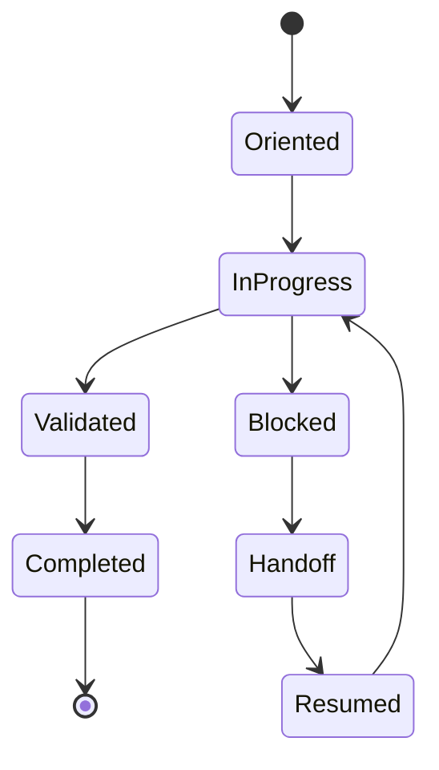

# Agent Task Standard (ATS)

ATS governs agent workflows, task records, lifecycle states, validation records, replayability, and handoff mechanisms.

## Document Suite

| File | Purpose |
| --- | --- |
| `Agent Task Standard.md` | Primary ATS specification. |
| `ATS.manifest.toml` | Standard manifest. |
| `templates/Agent-Task-Record.md` | Task record template. |
| `templates/Handoff-Note.md` | Handoff template. |
| `Adoption-Guide.md` | ATS adoption procedure. |
| `Validation-Checklist.md` | Agent task readiness checklist. |
| `CHANGELOG.md` | ATS version history. |

## SFDS Suite Model

`ATS.manifest.toml` describes ATS as a standard suite.
The templates in `templates/` describe agent task records and handoff notes governed by ATS.

## Core Rule

WGS tells an agent what to read before working. ATS records what the agent did, why it did it, how it validated the work, and what another agent needs to resume safely.

