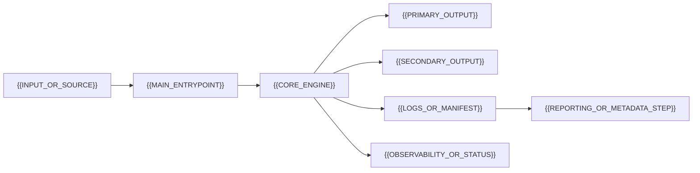

# {{PROJECT_NAME}}


{{PROJECT_NAME}} is {{CLEAR_PROJECT_DESCRIPTION}}.

{{PROOF_OR_IMPORTANT_RESULT_SENTENCE}}


Quick links: [Architecture]({{ARCHITECTURE_DOC_PATH}}) | [Quickstart]({{QUICKSTART_DOC_PATH}}) | [Operations]({{OPERATIONS_DOC_PATH}}) | [Release Notes]({{RELEASE_NOTES_PATH}})

---

## What This Project Covers

| Area | Summary |
|------|---------|
| {{AREA_1}} | {{AREA_1_SUMMARY}} |
| {{AREA_2}} | {{AREA_2_SUMMARY}} |
| {{AREA_3}} | {{AREA_3_SUMMARY}} |
| {{AREA_4}} | {{AREA_4_SUMMARY}} |
| {{AREA_5}} | {{AREA_5_SUMMARY}} |
| {{AREA_6}} | {{AREA_6_SUMMARY}} |

---

## Verified Result

Use this section for the strongest evidence that the project works: a benchmark, production run, release validation, demo screenshot, test result, customer workflow, migration record, or completed operational milestone.

| Metric | Value |
|--------|-------|
| {{METRIC_1}} | `{{VALUE_1}}` |
| {{METRIC_2}} | `{{VALUE_2}}` |
| {{METRIC_3}} | `{{VALUE_3}}` |
| {{METRIC_4}} | `{{VALUE_4}}` |
| Date verified | `{{YYYY-MM-DD}}` |
| Result | {{RESULT_SUMMARY}} |

{{VERIFIED_RESULT_EXPLANATION}}

---

## Architecture at a Glance



{{ARCHITECTURE_SUMMARY}}

---

## Repository Layout

```text
{{ENTRYPOINT_FILE}}             {{ENTRYPOINT_DESCRIPTION}}
{{SOURCE_DIR}}/                 {{SOURCE_DIR_DESCRIPTION}}
{{TEST_DIR}}/                   {{TEST_DIR_DESCRIPTION}}
{{DOCS_DIR}}/                   {{DOCS_DIR_DESCRIPTION}}
{{CONFIG_FILE}}                 {{CONFIG_DESCRIPTION}}
{{MANIFEST_FILE}}               {{MANIFEST_DESCRIPTION}}
```

---

## Components

### `{{COMPONENT_1}}`

{{COMPONENT_1_DESCRIPTION}}

- {{COMPONENT_1_CAPABILITY_1}}
- {{COMPONENT_1_CAPABILITY_2}}
- {{COMPONENT_1_CAPABILITY_3}}

### `{{COMPONENT_2}}`

{{COMPONENT_2_DESCRIPTION}}

- {{COMPONENT_2_CAPABILITY_1}}
- {{COMPONENT_2_CAPABILITY_2}}
- {{COMPONENT_2_CAPABILITY_3}}

### `{{COMPONENT_3}}`

{{COMPONENT_3_DESCRIPTION}}

- {{COMPONENT_3_CAPABILITY_1}}
- {{COMPONENT_3_CAPABILITY_2}}
- {{COMPONENT_3_CAPABILITY_3}}

---

## Data, Storage, or Artifact Model

Use this section to explain what the project creates, consumes, stores, or transforms.

| Artifact | Purpose |
|----------|---------|
| `{{ARTIFACT_1}}` | {{ARTIFACT_1_PURPOSE}} |
| `{{ARTIFACT_2}}` | {{ARTIFACT_2_PURPOSE}} |
| `{{ARTIFACT_3}}` | {{ARTIFACT_3_PURPOSE}} |
| `{{ARTIFACT_4}}` | {{ARTIFACT_4_PURPOSE}} |

{{ARTIFACT_MODEL_EXPLANATION}}

---

## Manifest and Audit Trail

If this project has a machine-readable manifest, logs, run records, release records, database migrations, checksums, or generated metadata, explain them here.

Common record fields:

- `{{FIELD_1}}`
- `{{FIELD_2}}`
- `{{FIELD_3}}`
- `{{FIELD_4}}`
- `{{FIELD_5}}`
- `{{FIELD_6}}`

| Status | Meaning |
|--------|---------|
| `{{STATUS_1}}` | {{STATUS_1_MEANING}} |
| `{{STATUS_2}}` | {{STATUS_2_MEANING}} |
| `{{STATUS_3}}` | {{STATUS_3_MEANING}} |

{{AUDIT_TRAIL_EXPLANATION}}

---

## Observability

Use this section for logs, dashboards, health checks, metrics, status APIs, diagnostics, debug tools, or validation commands.

| Surface | Purpose |
|---------|---------|
| `{{OBSERVABILITY_SURFACE_1}}` | {{OBSERVABILITY_SURFACE_1_PURPOSE}} |
| `{{OBSERVABILITY_SURFACE_2}}` | {{OBSERVABILITY_SURFACE_2_PURPOSE}} |
| `{{OBSERVABILITY_SURFACE_3}}` | {{OBSERVABILITY_SURFACE_3_PURPOSE}} |

Important signals:

- `{{SIGNAL_1}}`
- `{{SIGNAL_2}}`
- `{{SIGNAL_3}}`
- `{{SIGNAL_4}}`

{{OBSERVABILITY_NOTES}}

---

## Quick Start

### Prerequisites

- {{PREREQUISITE_1}}
- {{PREREQUISITE_2}}
- {{PREREQUISITE_3}}

### Setup

```powershell
{{SETUP_COMMAND_1}}
{{SETUP_COMMAND_2}}
{{SETUP_COMMAND_3}}
```

### Build

```powershell
{{BUILD_COMMAND_1}}
{{BUILD_COMMAND_2}}
```

### Run

```powershell
{{RUN_COMMAND_1}}
{{RUN_COMMAND_2}}
```

### Verify

```powershell
{{VERIFY_COMMAND_1}}
{{VERIFY_COMMAND_2}}
```

---

## Primary Workflow

Describe the main workflow someone should use when they operate the project.

```powershell
{{WORKFLOW_COMMAND_1}}
{{WORKFLOW_COMMAND_2}}
{{WORKFLOW_COMMAND_3}}
```

Expected output:

```text
{{EXPECTED_OUTPUT_EXAMPLE}}
```

---

## Operational Guidance

- {{OPERATIONAL_GUIDANCE_1}}
- {{OPERATIONAL_GUIDANCE_2}}
- {{OPERATIONAL_GUIDANCE_3}}
- {{OPERATIONAL_GUIDANCE_4}}
- {{OPERATIONAL_GUIDANCE_5}}

---

## Development

Build:

```powershell
{{DEV_BUILD_COMMAND}}
```

Test:

```powershell
{{DEV_TEST_COMMAND}}
```

Format or lint:

```powershell
{{DEV_FORMAT_COMMAND}}
{{DEV_LINT_COMMAND}}
```

Current automated coverage includes {{TEST_COVERAGE_SUMMARY}}.

---

## Documentation Map

| File | Purpose |
|------|---------|
| [{{DOC_1_TITLE}}]({{DOC_1_PATH}}) | {{DOC_1_PURPOSE}} |
| [{{DOC_2_TITLE}}]({{DOC_2_PATH}}) | {{DOC_2_PURPOSE}} |
| [{{DOC_3_TITLE}}]({{DOC_3_PATH}}) | {{DOC_3_PURPOSE}} |
| [{{DOC_4_TITLE}}]({{DOC_4_PATH}}) | {{DOC_4_PURPOSE}} |
| [{{MANIFEST_TITLE}}]({{MANIFEST_PATH}}) | Machine-readable project manifest. |

---

## Release Posture

{{PROJECT_NAME}} is {{RELEASE_POSTURE_SUMMARY}}.

| Field | Value |
|-------|-------|
| Stage | {{STAGE}} |
| Completion | {{COMPLETION_PERCENT}} |
| Stability | {{STABILITY}} |
| Technical debt | {{TECHNICAL_DEBT}} |
| Maintenance burden | {{MAINTENANCE_BURDEN}} |
| License | {{LICENSE}} |
| Maintainer | {{MAINTAINER}} |

---

## Core Principles

**{{PRINCIPLE_1_TITLE}}**
{{PRINCIPLE_1_BODY}}

**{{PRINCIPLE_2_TITLE}}**
{{PRINCIPLE_2_BODY}}

**{{PRINCIPLE_3_TITLE}}**
{{PRINCIPLE_3_BODY}}

**{{PRINCIPLE_4_TITLE}}**
{{PRINCIPLE_4_BODY}}

---

## Roadmap

- [ ] {{ROADMAP_ITEM_1}}
- [ ] {{ROADMAP_ITEM_2}}
- [ ] {{ROADMAP_ITEM_3}}
- [ ] {{ROADMAP_ITEM_4}}

---

## License

{{LICENSE}} License. See [LICENSE](LICENSE) for details.

---

## Author

Maintained by {{MAINTAINER}}.

```html
<script type="application/ld+json">
{
  "@context": "https://schema.org",
  "@type": "SoftwareSourceCode",
  "name": "{{PROJECT_NAME}}",
  "description": "{{ONE_SENTENCE_DESCRIPTION}}",
  "license": "{{LICENSE_URL}}",
  "programmingLanguage": ["{{LANGUAGE_1}}", "{{LANGUAGE_2}}"],
  "author": {
    "@type": "Person",
    "name": "{{MAINTAINER}}"
  }
}
</script>
```
