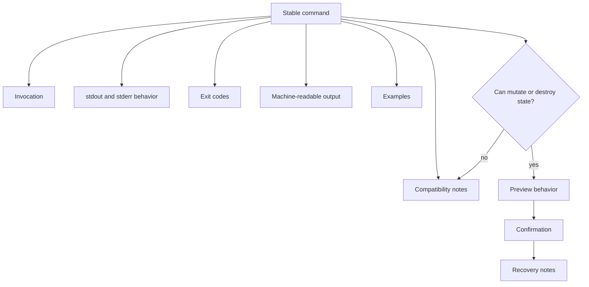

# Command Tool Standard (CTS)

CTS governs command-line tools and automation utilities. It makes CLI behavior stable enough for humans, scripts, and agents to rely on.

For release distribution, CTS-governed tools use the channel that fits their ecosystem: GitHub releases or package registries for cross-platform CLIs, ZIP/portable binaries or package managers for Windows CLIs, crates.io/PyPI/Go modules for language tools, and the simplest documented path for internal utilities. Publishable binary or archive artifacts should carry an ARHS `.hashmanifest.toml`; ArchiveHasher and `manifest-signer.exe` remain AAMHS archive-preservation signing tools.

## Document Suite

| File | Purpose |
| --- | --- |
| `Command Tool Standard.md` | Primary CTS specification. |
| `CTS.manifest.toml` | Standard manifest. |
| `CommandOutput.schema.json` | Reusable CTS JSON output envelope schema. |
| `JSON-Data-Payload-Guidance.md` | Guidance for command-specific `data` payloads. |
| `Command-Versioning-Migration-Notes.md` | Compatibility and migration policy for command changes. |
| `CI-Usage.md` | Local and CI snippets for CTS validation support. |
| `Progress-Output-Compatibility.md` | Compatibility notes for progress output, stderr, JSON stdout, and JSONL event mode. |
| `templates/Command-Contract.md` | Command documentation template. |
| `templates/CLI-Release-Checklist.md` | Release readiness template. |
| `examples/Manifest-Audit-Command-Contract.md` | Filled command contract example. |
| `examples/manifest-audit-output-ok.json` | Successful CTS JSON envelope example. |
| `examples/manifest-audit-output-error.json` | Error CTS JSON envelope example. |
| `examples/fixtures/` | Machine-checkable JSON envelope fixtures. |
| `examples/reference-implementations/python_cli.py` | Minimal Python reference implementation. |
| `tools/cts_validate.py` | Lightweight validator for command contracts and JSON envelope examples. |
| `tools/cts_lint_contract.py` | Linter for command-contract stability risks. |
| `Adoption-Guide.md` | How CLI projects adopt CTS. |
| `Validation-Checklist.md` | Manual CTS readiness checks. |
| `CHANGELOG.md` | CTS version history. |

## SFDS Suite Model

`CTS.manifest.toml` describes CTS as a standard suite.
The templates in `templates/` describe command contracts and CLI release records governed by CTS.

## Core Contract

Every stable command needs documented invocation, stdout/stderr behavior, exit codes, machine-readable output shape when applicable, examples, and compatibility notes. Destructive commands must document preview, confirmation, and recovery behavior.

## Validation Posture

CTS is operational through `CommandOutput.schema.json`, the command-contract template, the CLI release checklist, filled examples, the adoption guide, the manual validation checklist, and `tools/cts_validate.py`.

`tools/cts_validate.py` is intentionally lightweight. It validates command-contract document shape and JSON output envelope examples; it does not prove arbitrary CLI runtime behavior. `tools/cts_lint_contract.py` flags common contract stability risks for reviewer attention.

