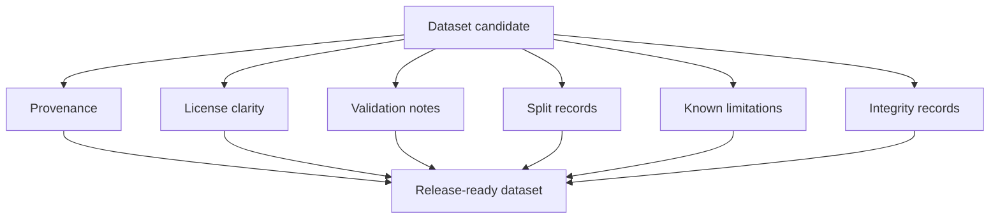

# Dataset Development Standard (DDS)

DDS governs datasets, training corpora, evaluation sets, provenance, licensing, validation, splits, integrity, usage constraints, and preservation.

## Document Suite

| File | Purpose |
| --- | --- |
| `Dataset Development Standard.md` | Primary DDS specification. |
| `DDS.manifest.toml` | Standard manifest. |
| `templates/DATASET.manifest.toml` | Dataset manifest template. |
| `templates/Provenance-Record.md` | Provenance template. |
| `examples/Example-Provenance-Record.md` | Filled provenance evidence example. |
| `Adoption-Guide.md` | DDS adoption procedure. |
| `Validation-Checklist.md` | Dataset readiness checklist. |
| `CHANGELOG.md` | DDS version history. |

## SFDS Suite Model

`DDS.manifest.toml` describes DDS as a standard suite.
The templates in `templates/` describe dataset manifests and provenance records governed by DDS.

## Release Rule

A dataset without provenance, license clarity, validation notes, known limitations, and integrity records is not ready for release or long-term preservation.

