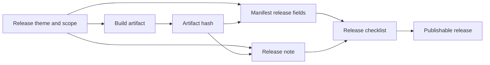

# Desktop Application Release Standard (DRS)


A release framework for local-first Windows desktop applications. Defines what a release is, how it is verified, and what documentation it requires — so that someone who did not build the application can understand what changed, why it changed, and how to verify the artifact they received.

Derived from practices established in Filing Cabinet. Extended through the Aegis project.

DRS conforms to SFDS at the standard-suite governance layer and is the first reference implementation of the mature City Hall standard-suite pattern. SFDS describes how this documentation suite is indexed, validated, and normalized; DRS remains authoritative for desktop application release behavior, release manifests, release notes, artifact integrity, and verification gates.

---

## What This Standard Covers

| Area | Summary |
|------|---------|
| Versioning | Semantic versioning rules, when to increment, version source of truth |
| Release documents | Required structure, prohibited content, required fields |
| Artifact naming | Deterministic, parseable filename conventions |
| Artifact integrity | SHA-256 in DRS records; ARHS `.hashmanifest.toml` for release hash manifests |
| Build verification | What must be tested and recorded for every release |
| Project manifests | Machine-readable project state and release record |
| Documentation delivery | What ships with the build and why |
| Release checklists | Per-release gates and per-version verification blocks |
| Release blockers | Conditions that block a release regardless of feature completeness |
| Release cadence | Scope-driven, not calendar-driven |

---

## Document Suite

DRS follows the SFDS two-layer model:

- `DRS.manifest.toml` describes the DRS standard suite.
- `DesktopApplicationRelease.manifest.schema.toml` and `templates/ProjectName.manifest.toml` describe adopter project manifests governed by DRS.

The README is the City Hall role/index for the DRS suite. `Desktop Application Release Standard.md` is the authoritative DRS specification.

### Core

| File | Purpose |
|------|---------|
| [`Desktop Application Release Standard.md`](Desktop%20Application%20Release%20Standard.md) | The full release standard. Read this first. |
| [`DesktopApplicationRelease.manifest.schema.toml`](DesktopApplicationRelease.manifest.schema.toml) | Machine-readable schema defining all required and optional manifest fields. |
| [`ReleaseNoteMetadata.schema.json`](ReleaseNoteMetadata.schema.json) | Machine-readable release-note metadata schema for JSON-LD or automation exports. |
| [`docs/CI-Usage.md`](docs/CI-Usage.md) | CI and local automation snippets for running `drs.ps1`. |
| [`docs/Troubleshooting.md`](docs/Troubleshooting.md) | Common `drs.ps1` failures, runtime compatibility, and script trust guidance. |
| [`docs/Release-Gating-Workflow.md`](docs/Release-Gating-Workflow.md) | Continuous release-gating workflow using manifest, integrity, and release checks. |

### Templates

Copy each template into your project's `docs/` directory, rename it, and fill it in. Templates that apply to every release are marked **recurring**.

| Template | Purpose | Cadence |
|----------|---------|---------|
| [`templates/ProjectName.manifest.toml`](templates/ProjectName.manifest.toml) | Concrete project manifest — machine-readable project state and release record | One per project; updated every release |
| [`templates/Release-Note.md`](templates/Release-Note.md) | Release note — what shipped, what it does, the artifact hash | **Recurring** — every release |
| [`templates/Release-Note.Metadata.jsonld`](templates/Release-Note.Metadata.jsonld) | Optional structured release-note metadata export | Recurring when automation or indexing needs structured release records |
| [`templates/Release-Checklist.md`](templates/Release-Checklist.md) | Pre-release gate checklist with per-version verification blocks | One per project; appended every release |
| [`templates/Trust-Security-Model.md`](templates/Trust-Security-Model.md) | How the application handles sensitive data and who it trusts | Before any security-relevant release |
| [`templates/Dependency-Provenance.md`](templates/Dependency-Provenance.md) | Exact versions, sources, and build flags for every external dependency | Before any public release |
| [`templates/Build-Reproducibility-Guide.md`](templates/Build-Reproducibility-Guide.md) | Clean-clone build steps, required tools, exact versions | Before sharing with other developers |
| [`templates/Threat-Model.md`](templates/Threat-Model.md) | Attack surface, trust boundaries, known limitations | Before any security claim |
| [`templates/Integrity-Validation-Matrix.md`](templates/Integrity-Validation-Matrix.md) | What healthy state looks like; how to detect and repair drift | When a repair or verification workflow exists |
| [`templates/Data-Migration-Contract.md`](templates/Data-Migration-Contract.md) | Data format migration specification — backup, steps, rollback, failure behavior | Any release that changes persisted data format |
| [`templates/Withdrawn-Release.md`](templates/Withdrawn-Release.md) | Withdrawn release record — reason, impact, remediation, post-withdrawal review | When a published release must be retracted |

---

## The Release in One Sentence

> The release note is the human promise. The manifest is the machine record. The hash binds them.



---

## Document Tiers

Not every project needs every document immediately. Use the tier that matches your project's maturity and risk profile.

| Tier | Required When | Documents |
|------|--------------|-----------|
| **Minimal** | Small utility, no sensitive data | README, Manifest, Release Note, Release Checklist |
| **Standard** | Local-first app with persistent user data | + Build Reproducibility Guide, Dependency Provenance |
| **Security-sensitive** | Vaults, encryption, credentials, key management | + Trust/Security Model, Threat Model, Integrity Validation Matrix |
| **Distribution-grade** | Microsoft Store MSIX, documented direct distribution, signing/provenance, auto-update | + SBOM, Withdrawn Release policy, Data Migration Contracts |

Aegis and Filing Cabinet operate at the Security-sensitive tier. Most tools can start at Minimal and promote as they mature.

---

## CLI

`drs.ps1` is a PowerShell CLI that makes the standard executable. Run it from any DRS-compliant project directory.

## Validation Posture

`DRS.manifest.toml` registers `drs.ps1` as the active validator for this suite. Reviews should therefore not report missing validation tooling for DRS. Any compatibility notes should focus on the PowerShell/runtime expectations for `drs.ps1`, not on adding unrelated hashing, signing, or validator scope.

### Typical workflow

```powershell
# Typical release workflow
.\path\to\drs.ps1 verify-manifest               # check fields before building
# [build installer]
.\path\to\drs.ps1 hash artifacts\installer\*.msi # get SHA-256 for manifest + release note
# [paste hash into manifest and release note]
.\path\to\drs.ps1 check-release                 # full gate before publishing
```

| Command | What it checks |
|---------|---------------|
| `drs new <AppName>` | Scaffold project with manifest + checklist |
| `drs validate` | All required manifest fields present |
| `drs verify-manifest` | Field consistency (version match, hash format, status) |
| `drs check-release` | Full gate: manifest + artifact hash + release note + checklist + publish docs |
| `drs hash <path>` | SHA-256 + file size with copy-pasteable manifest snippet |
| `drs hash <path> --blake3` | SHA-256 plus optional BLAKE3 when `b3sum` or `blake3` is installed |
| `drs init-docs` | Copy all doc templates to `docs/` with project name applied |

`tools/drs_integrity_check.py` is a companion checker for declared BLAKE3 and signing metadata. `examples/Release-Folder-Verifier.html` is a minimal local GUI-style verifier for release-folder evidence.

## Distribution Policy

For public Windows GUI applications, the default DRS distribution path is MSIX submitted through the Microsoft Store. The Microsoft Store signs accepted Store packages; the project release record should state `distribution = "microsoft-store-msix"` and `signing = "microsoft-store-signed"` or an equally clear statement.

Development and tester builds may use sideloaded MSIX packages signed with a self-signed development certificate. These records must state that the build is non-production, for example `signing = "self-signed-development"`.

For cross-platform GUI applications, the Windows package should normally follow the MSIX/Microsoft Store path while other operating systems keep their appropriate native or ecosystem package flow, such as NSIS, DMG, AppImage, deb/rpm, or package-manager distribution.

`winapp` is the preferred local Windows GUI packaging helper for app asset generation, `Package.appxmanifest` management, development certificate creation, and MSIX packing. `msstore` is the preferred Microsoft Store submission helper. Tool output is evidence, not the release decision by itself; DRS records must still distinguish distribution from signing and must verify the resulting package.

For Store releases, reserve the product identity in Partner Center before building the submission package. The MSIX manifest must match the Store-provided `Package/Identity/Name`, `Package/Identity/Publisher`, and `Package/Properties/PublisherDisplayName`. First submissions may use Partner Center website upload so Microsoft certification feedback can identify package, identity, asset, or metadata mismatches before the flow is automated.

Compute ARHS release hashes after the final Store candidate package is built and accepted by Partner Center package validation. Identity, display-name, asset, or package-structure corrections change the MSIX and invalidate earlier package hashes.

Direct MSI/EXE or non-Store distribution is allowed only when the release record explains why that channel is being used. Public direct distribution should use CA-backed signing or Microsoft Trusted Signing where appropriate; internal/private direct distribution may be explicitly `unsigned-internal` or self-signed when that is the real trust model.

DRS records the desktop release evidence. ARHS records the release hash manifest. AAMHS records archive-preservation integrity and detached signatures when the release or evidence bundle is preserved as an archive.

---

## Quick Start

### New project

1. Copy `templates/ProjectName.manifest.toml` → `YourAppName.manifest.toml` at your project root
2. Copy `templates/Release-Checklist.md` → `docs/YourAppName - Release Checklist.md`
3. Fill in `[project]` and `[metadata]` fields in the manifest
4. Write your first release note from `templates/Release-Note.md` — **do this before coding begins**

### Before each release

1. Update the manifest: `version`, `[release]`, `[release.installer]`, `[release.verified]`
2. Write or update the release note using the template
3. Run through all Pre-Release Gates in the Release Checklist
4. Append a Per-Version Verification Block to the checklist
5. Confirm the SHA-256 in the release document matches the artifact file on disk

### What ships in `docs/`

Every installed application must include at minimum:
- The release note for the current version
- The trust/security model document (if the application handles sensitive data)
- The integrity validation matrix (if a repair or verification workflow exists)

Documentation files are text. They add negligible size and are the most durable part of the release artifact.

---

## Core Principles

**Ship understanding, not just binaries.**
A release is not complete until someone who did not build it can understand what changed, why it changed, and how to verify the artifact they received.

**Every release has a theme.**
Name the release before writing code. If the work does not match the name, either the name was wrong or the scope drifted. Catch this before writing the release note.

**The artifact hash is the release.**
Publishing an installer without a SHA-256 hash in the release document, and an ARHS hash manifest when the artifact is publishable, is a file drop, not a release.

**Detect before mutating.**
Any system that changes state should make the change visible before it happens. Irreversible actions require explicit operator approval.

**Documentation lag is a release blocker.**
If the release note, manifest, and checklist are not ready, the release is not ready.

---

## Example Project

`examples/MiniVault/` shows what a completed, filled-in DRS document suite looks like for a realistic local-first desktop application. All four required documents are present and cross-consistent:

- `MiniVault.manifest.toml` — complete manifest with all required fields
- `docs/MiniVault v0.1.0.md` — finished release note with hash, theme, design boundaries
- `docs/MiniVault - Release Checklist.md` — checklist with completed per-version block
- `docs/MiniVault - Trust and Security Model.md` — full trust model including crypto primitives, trust boundaries, and known limitations

`examples/FieldDesk/FieldDesk.manifest.toml` shows a second filled adopter manifest with non-trivial dependency provenance, data migration, BLAKE3, and release verification fields.

---

## Lineage

This standard was derived from practices established in Filing Cabinet and extended through the Aegis project. See Section 13 of the standard for the full provenance record.
