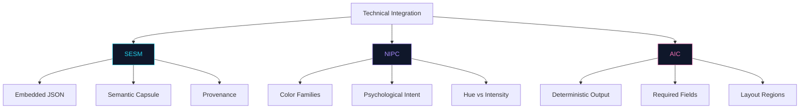
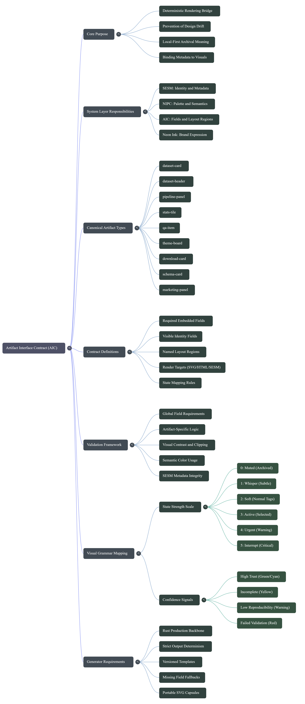
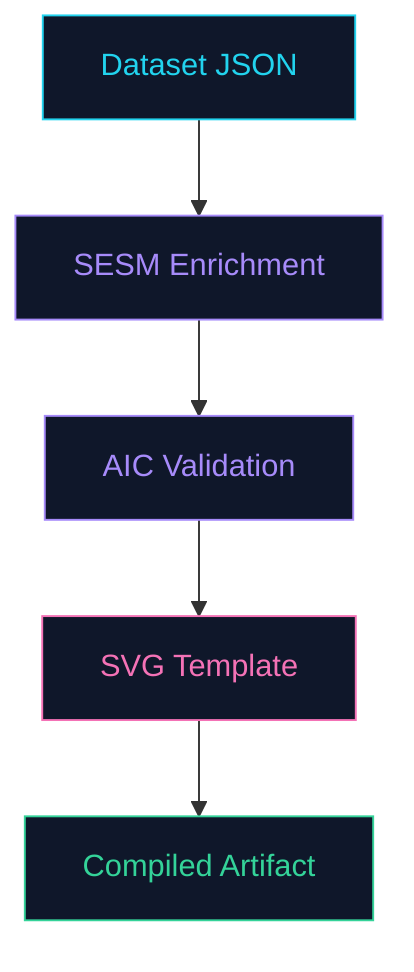

# Artifact Interface Contract (AIC)

**Status:** Draft v0.1.1  
**Host System:** Aptlantis Studio  
**Compatible With:** SESM v0.3.x, NIPC v0.1.x, Neon Ink v0.1.x, APGC v0.1.x
**Scope:** Contract layer that defines how structured data, SESM metadata, NIPC palette semantics, and Neon Ink brand expression become deterministic rendered artifacts in SVG, HTML, and related brand surfaces.

---

## 1. Overview

The **Artifact Interface Contract (AIC)** is the bridge between SESM, NIPC, and Neon Ink.



SESM defines what an artifact means structurally. NIPC defines what color semantics, families, psychological intent, and intensity mean. Neon Ink defines how the brand behaves visually and verbally. AIC defines how the system turns those meanings into consistent rendered artifacts.

```text
DATA -> SESM -> AIC -> SVG/HTML -> USER
```

In this flow:

- **Data** provides source records, manifests, pipeline output, and content.
- **SESM** describes identity, semantics, provenance, links, crawl hints, LLM hints, and UI hints.
- **NIPC** supplies semantic role, semantic family, psychological intent, palette validation, and intensity rules.
- **AIC** defines artifact types, required fields, layout regions, render targets, state behavior, and interaction rules.
- **Neon Ink** supplies typography, density, panel grammar, page composition, and brand voice.
- **SVG/HTML** delivers the final interface.

AIC exists to prevent design drift. Given the same source data, SESM block, artifact type, and Neon Ink version, the generator should produce the same artifact structure every time.

<p align="center">
  
</p>

---

## 2. Relationship To SESM, NIPC, And Neon Ink

### 2.1 Layer Responsibilities

| Layer | Canonical Document | Responsibility |
|---|---|
| Meaning | [SESM v0.2.md](SESM-v0.2.md) | Embedded metadata, artifact identity, provenance, links, agent/crawler hints |
| Palette | [NIPC v0.1.1.md](NIPC-v0.1.1.md) | Palette families, semantic roles, psychological intent, intensity, palette validation |
| Contract | [AIC v0.1.1.md](AIC-v0.1.1.md) | Artifact type contract, required fields, layout regions, render targets, state mapping |
| Expression | [Neon Ink v0.1.md](../design/NeonInk-v0.1.md) | Brand expression, typography, panel grammar, page composition, brand voice |

### 2.2 What SESM Answers

SESM answers:

- What is this artifact?
- Where did it come from?
- What data or template produced it?
- What does it mean?
- Where should agents, crawlers, or users go for canonical context?

Example:

```json
{
  "sesm_version": "0.3.0",
  "asset": {
    "id": "rust-code-corpus-card",
    "role": "dataset-card",
    "title": "Rust Code Corpus"
  },
  "theme": {
    "id": "neon-ink",
    "semantic_role": "code-heat",
    "semantic_family": "creation-build-code",
    "psychological_intent": "signal-hands-on-code-build-work",
    "intensity": 2,
    "state": "active"
  }
}
```

### 2.3 What NIPC Answers

NIPC answers:

- Which semantic role should carry the hue?
- Which family should group that role?
- What cognitive or psychological purpose does the color serve?
- What intensity is appropriate before the UI becomes noisy?
- Which palette usages should validators warn about?

Example:

```json
{
  "semantic_role": "pipeline",
  "semantic_family": "process-transformation",
  "psychological_intent": "explain-system-flow",
  "intensity": 2,
  "priority": "medium"
}
```

### 2.4 What Neon Ink Answers

Neon Ink answers:

- How should panels, typography, density, and page composition behave?
- What does an Aptlantis Studio surface feel like?
- Which brand voice rules apply?
- How should brand collateral stay consistent with the website and generated artifacts?

Example:

```json
{
  "semantic": {
    "code_heat": "#F97316",
    "process": "#A78BFA",
    "info": "#22D3EE"
  }
}
```

### 2.5 What AIC Answers

AIC answers:

- What must a `dataset-card` display?
- Which fields are required, optional, derived, or hidden?
- Which spatial regions does the artifact use?
- Which fields render into SVG, HTML, metadata, or all three?
- How does state map to border, glow, animation, and interaction?
- What validates whether an artifact is contract-compliant?

Example:

```json
{
  "aic_version": "0.1.0",
  "artifact_type": "dataset-card",
  "required_fields": ["title", "dataset_id", "state", "records", "tokens"],
  "layout": {
    "regions": ["icon", "title", "tags", "description", "stats", "actions", "state_badge"]
  }
}
```

---

## 3. Goals

AIC is designed to:

1. Make rendered artifacts deterministic.
2. Bind SESM metadata to Neon Ink visual semantics.
3. Define canonical artifact types for the Aptlantis Studio website and generator.
4. Separate SVG responsibilities from HTML responsibilities.
5. Prevent field, layout, and state drift across pages.
6. Make artifact generation testable.
7. Support validators, preview engines, editors, diff tools, and future visual builders.
8. Preserve local-first archival meaning.
9. Keep dense interfaces scannable and semantically consistent.
10. Allow theme variants without breaking core artifact contracts.

---

## 4. Non-Goals

AIC does not:

- replace SESM metadata
- replace Neon Ink visual rules
- define all dataset schemas
- define all Rust generator internals
- require every artifact to be SVG
- require JavaScript for basic meaning
- define access control, authentication, or private metadata policy
- force marketing graphics to expose full technical metadata
- define a complete design tool file format

AIC is a rendering contract, not a storage format or brand manual.

---

## 5. Terminology

### Artifact Type

A stable named primitive that the generator can render, such as `dataset-card`, `pipeline-panel`, or `qa-item`.

### Contract

The required fields, optional fields, layout regions, render targets, state behavior, and validation rules for an artifact type.

### Region

A named spatial slot in an artifact layout. Examples: `icon`, `title`, `tags`, `stats`, `actions`, `state_badge`.

### Render Target

The output context where a field or region appears. Common targets are `svg`, `html`, `sesm`, and `brand`.

### Visible Field

A field that must be shown to the user in the rendered UI.

### Embedded Field

A field that must be preserved in SESM or machine-readable metadata, whether or not it appears visually.

### Derived Field

A field computed from source data, such as `quality_label` from `quality_score`, or `state_glow` from `state`.

### Canonical Action

The primary destination or operation for an artifact, such as opening the canonical dataset page, downloading a release, or viewing a pipeline report.

---

## 6. AIC Block Structure

An AIC contract is a JSON-compatible object.

Recommended top-level structure:

```json
{
  "aic_version": "0.1.0",
  "artifact_type": "dataset-card",
  "compatible_with": {
    "sesm": "0.3.x",
    "nipc": "0.1.x",
    "neon_ink": "0.1.x",
    "apgc": "0.1.x"
  },
  "fields": {},
  "theme": {},
  "layout": {},
  "semantic_mapping": {},
  "state_mapping": {},
  "fallback_rules": {},
  "render": {},
  "render_targets": {},
  "interaction": {},
  "validation": {}
}
```

The contract may live as:

- a standalone JSON or TOML contract file
- embedded generator configuration
- documented Markdown examples
- a Rust struct or enum representation
- a validation schema

The contract should remain stable enough that old artifacts can be validated years later.

---

## 7. Canonical Artifact Types

The following artifact types are the canonical AIC v0.1 primitives.

```json
{
  "artifact_types": [
    "dataset-card",
    "dataset-header",
    "pipeline-panel",
    "qa-item",
    "stats-tile",
    "theme-board"
  ]
}
```

Artifact type names must be lowercase and hyphen-separated.

Other useful artifact shapes, such as `navigation-card`, `related-dataset-list`, `download-card`, `schema-card`, `quality-report-panel`, `compatibility-panel`, and `brand-promo-panel`, should be treated as extension contracts until promoted into a later AIC version.

### 7.1 Artifact Definitions

AIC makes each artifact type a first-class compiler target, not a hand-designed component.

```json
{
  "artifact_definitions": {
    "dataset-card": "Compact dataset preview artifact.",
    "dataset-header": "Primary dataset identity artifact.",
    "pipeline-panel": "Pipeline state and execution artifact.",
    "qa-item": "Indexed documentation or FAQ artifact.",
    "stats-tile": "Single metric artifact.",
    "theme-board": "Palette and theme identity artifact."
  }
}
```

---

## 8. Global Field Contract

All generated artifacts should support a shared identity core.

### 8.0 Required Fields

AIC contracts must say which fields are required and which fields are optional. Required fields are never guessed.

Example:

```json
{
  "qa-item": {
    "required": ["question", "category", "id"],
    "optional": ["answer", "tags", "state"]
  }
}
```

If a required field is missing, production generation fails. Preview generation may emit a warning artifact, but it must not silently invent missing data.

### 8.1 Required Embedded Fields

These fields should be present in SESM for generated production artifacts:

```json
{
  "artifact_id": "rust-code-corpus-card",
  "artifact_type": "dataset-card",
  "state": "active",
  "semantic_role": "code-heat",
  "semantic_family": "creation-build-code",
  "psychological_intent": "signal-hands-on-code-build-work",
  "intensity": 2,
  "source_manifest": "data/datasets/rust-code-corpus.json",
  "template_id": "dataset-card-v1"
}
```

### 8.2 Recommended Visible Identity Fields

Every non-decorative artifact should visibly expose:

- title or label
- artifact type, category, or role
- state when state matters
- primary semantic accent
- at least one trust or navigation cue

### 8.2.1 Visible vs Embedded Fields

AIC separates what the user sees from what SESM preserves.

```json
{
  "visible": ["title", "stats", "state"],
  "embedded": ["artifact_id", "provenance", "theme_id"]
}
```

Visible fields are rendered into SVG, HTML, or both. Embedded fields are stored in SESM or another machine-readable payload even when they are not shown in the UI.

### 8.3 Required Compatibility Fields

Generated artifacts should preserve:

```json
{
  "aic_version": "0.1.0",
  "sesm_version": "0.3.0",
  "theme_id": "neon-ink",
  "theme_version": "0.1.0"
}
```

These may appear in SESM metadata rather than visible UI.

### 8.4 Theme Styling Object

AIC-compatible artifacts should support the NIPC theme styling object while preserving `semantic_role`.

```json
{
  "theme": {
    "id": "neon-ink",
    "palette_contract": "nipc-0.1",
    "semantic_role": "pipeline",
    "semantic_family": "process-transformation",
    "psychological_intent": "explain-system-flow",
    "state": "active",
    "intensity": 2,
    "glow": "soft",
    "priority": "medium"
  }
}
```

`semantic_role` determines the hue token. `semantic_family` supports grouping, filtering, and validation. `psychological_intent` records why the hue was chosen. `state`, `intensity`, `glow`, and `priority` keep rendering deterministic.

---

## 9. Artifact Contracts

### 9.1 `dataset-card`

Use for compact dataset previews on home, category, related, and listing pages.

```json
{
  "artifact_type": "dataset-card",
  "required": [
    "title",
    "dataset_id",
    "state",
    "semantic_role",
    "semantic_family",
    "records",
    "tokens"
  ],
  "optional": [
    "description",
    "icon",
    "tags",
    "license",
    "quality_score",
    "size",
    "created",
    "updated",
    "models_supported",
    "canonical_html"
  ],
  "layout": {
    "regions": [
      "icon",
      "title",
      "tags",
      "stats",
      "actions",
      "status"
    ],
    "flow": "left-icon-right-content",
    "density": "compact"
  },
  "render": {
    "svg": ["icon", "title", "tags", "core_stats", "state_badge"],
    "html": ["actions", "tooltips", "expanded_metadata"],
    "sesm": ["all_identity_fields", "provenance", "links", "theme"]
  }
}
```

Minimum visible stats:

- records
- tokens

Recommended visible stats:

- records
- tokens
- size
- license

### 9.1.1 Layout Regions

Layout regions are stable slots. Optional fields may collapse, but required regions must not drift.

```json
{
  "dataset-card": {
    "regions": [
      "icon",
      "title",
      "tags",
      "stats",
      "actions",
      "status"
    ]
  }
}
```

`status` may render as a badge, dot, rail, or compact state label depending on the target and density.

### 9.2 `dataset-header`

Use for primary dataset identity panels.

Required:

- title
- dataset ID
- state
- semantic role
- description
- tags
- records
- tokens
- license
- updated date
- canonical action

Recommended:

- quality score
- created date
- size
- latest pipeline run
- version
- supported formats

Layout regions:

```json
{
  "regions": [
    "breadcrumb",
    "icon",
    "title",
    "tags",
    "description",
    "primary_stats",
    "actions",
    "state_summary",
    "quality_summary"
  ],
  "flow": "identity-left-state-right",
  "density": "detailed"
}
```

### 9.3 `pipeline-panel`

Use for a pipeline run summary.

Required:

- pipeline ID
- state
- associated dataset
- stage list
- updated or completed timestamp

Recommended:

- records changed
- tokens changed
- warnings
- errors
- report link
- build ID

Render behavior:

- `running` uses violet border and pulse.
- `complete` or `verified` uses green status marks.
- `warning` uses yellow caveat markers.
- `error` uses red failure markers.

### 9.4 `stats-tile`

Use for one metric.

Required:

- label
- value
- semantic role

Optional:

- unit
- trend
- timestamp
- source
- tooltip

Rules:

- Do not glow unless the stat represents live state.
- Use mono labels.
- Keep values readable at a glance.

### 9.5 `qa-item`

Use for one FAQ, documentation, or knowledge-block entry.

Required:

- question
- category
- id

Optional:

- answer
- tags
- state
- related links
- source document
- last updated
- confidence
- expanded state

Layout:

```json
{
  "regions": ["index", "semantic_indicator", "title", "toggle", "body", "links"],
  "flow": "indexed-accordion",
  "density": "compact"
}
```

The semantic indicator is required for scannability.

### 9.6 `theme-board`

Use for presenting a theme as an artifact.

Required:

- theme ID
- theme name
- version
- background layer swatches
- semantic role swatches
- state behavior examples

Recommended:

- typography samples
- component examples
- SESM theme block
- token export
- intended surfaces

---

## 10. Semantic To Visual Mapping

AIC maps source state and NIPC semantic role to visual behavior. NIPC provides hue, family, psychological intent, and intensity rules. Neon Ink provides the surrounding visual grammar.

### 10.0 Semantic Mapping

Semantic mapping is the bridge from NIPC meaning to visual treatment. It decides which token acts as the primary accent and which visual channels it may control.

```json
{
  "semantic_mapping": {
    "code_heat": {
      "color": "orange",
      "border": true,
      "accent_weight": "primary"
    },
    "process": {
      "color": "violet",
      "glow": "pulse"
    }
  }
}
```

Semantic mapping must not override the artifact's state. For example, a `pipeline-panel` may use `process` as its primary semantic role while a small state marker uses `success`, `caution`, or `critical`.

### 10.1 State Mapping

```json
{
  "state": {
    "archived": {
      "intensity": 0
    },
    "active": {
      "intensity": 2
    },
    "running": {
      "intensity": 3,
      "animation": "pulse"
    },
    "success": {
      "intensity": 3,
      "color_override": "green"
    }
  },
  "state_mapping": {
    "idle": {
      "border": "archive",
      "glow": "none",
      "animation": "none",
      "intensity": 0
    },
    "active": {
      "border": "info",
      "glow": "soft",
      "animation": "none",
      "intensity": 2
    },
    "running": {
      "border": "process",
      "glow": "pulse",
      "animation": "pulse",
      "intensity": 4
    },
    "featured": {
      "border": "featured",
      "glow": "soft",
      "animation": "none",
      "intensity": 3
    },
    "complete": {
      "border": "success",
      "glow": "soft",
      "animation": "none",
      "intensity": 2
    },
    "verified": {
      "border": "success",
      "glow": "soft",
      "animation": "none",
      "intensity": 2
    },
    "warning": {
      "border": "caution",
      "glow": "soft",
      "animation": "none",
      "intensity": 3
    },
    "error": {
      "border": "error",
      "glow": "sharp",
      "animation": "none",
      "intensity": 4
    },
    "archived": {
      "border": "archive",
      "glow": "none",
      "animation": "none",
      "intensity": 0
    },
    "experimental": {
      "border": "experimental",
      "glow": "soft",
      "animation": "none",
      "intensity": 2
    }
  }
}
```

### 10.2 Color Intensity Rules

Color role and state strength are separate.

```text
color hue = semantic role
brightness/glow/animation = state strength or activity
```

Examples:

- faint cyan = idle structure
- soft cyan = active structure
- pulsing violet = running process
- strong red = critical failure
- muted slate = archived artifact

Use the NIPC intensity scale:

| Intensity | Name | Use |
|---:|---|---|
| `0` | muted | archived, unknown, background metadata |
| `1` | whisper | tiny dot, thin rail, subtle label |
| `2` | soft | normal tags, semantic indicator |
| `3` | active | selected item, highlighted card |
| `4` | urgent | warning, running, featured |
| `5` | interrupt | error or critical blocker only |

### 10.3 Confidence Layers

AIC supports optional confidence fields.

```json
{
  "confidence": {
    "trust_level": "high",
    "completeness": 0.92,
    "reproducibility": 0.98,
    "validation": "verified"
  }
}
```

Recommended visual expression:

| Confidence Signal | Visual Expression |
|---|---|
| High trust | stable green or cyan indicator |
| Incomplete | yellow indicator or partial bar |
| Low reproducibility | warning badge |
| Failed validation | red badge and report link |
| Unknown | muted metadata state |

Confidence should never replace explicit validation text. It should add scan-level meaning.

### 10.4 NIPC Palette Validation

AIC validators should warn when:

- red/risk roles are used for non-risk decoration
- green/trust roles appear without evidence fields such as validation, availability, reproducibility, or quality pass
- yellow/attention roles dominate a surface instead of acting as markers
- a compact artifact uses more than one dominant semantic family
- a `qa-item` lacks a semantic indicator
- a pipeline uses status color as the main hue instead of process/pipeline as the main hue plus a small state marker

---

## 11. SVG vs HTML Responsibility

AIC separates portable visual artifacts from interactive page behavior.

### 11.1 SVG Responsibilities

SVG should carry:

- artifact identity
- title
- primary semantic role
- state indicator
- compact visible metadata
- core stats
- tags when compact enough
- embedded SESM metadata
- stable visual layout

SVG is best for:

- dataset cards
- dataset headers
- pipeline panels
- static timeline snapshots
- theme boards
- navigation cards
- related dataset panels
- promotional artifact panels

### 11.2 HTML Responsibilities

HTML should carry:

- page layout
- interactive controls
- search/filter/sort
- expanded metadata
- keyboard focus behavior
- tooltips
- long-form text
- responsive reflow
- analytics hooks
- download controls
- forms or user input

HTML can wrap SVG artifacts, expose the same canonical data, and add interactions without changing the underlying artifact meaning.

### 11.3 Shared Responsibilities

Both SVG and HTML may show:

- title
- state
- tags
- primary stats
- canonical action

When SVG and HTML both show the same data, they should derive from the same source manifest or compiled artifact payload.

### 11.4 Render Target Contract

Example:

```json
{
  "dataset-card": {
    "render": {
      "svg": ["core_stats", "title", "tags"],
      "html": ["interactive_controls", "expanded_sections"]
    },
    "render_targets": {
      "svg": [
        "title",
        "tags",
        "icon",
        "state_badge",
        "records",
        "tokens"
      ],
      "html": [
        "canonical_link",
        "hover_metadata",
        "tooltip",
        "expanded_stats",
        "interactive_controls"
      ],
      "sesm": [
        "artifact_id",
        "asset.role",
        "theme",
        "provenance",
        "links",
        "crawl",
        "llm"
      ]
    }
  }
}
```

---

## 12. Interaction Contracts

Interactions should be declared through AIC and reflected in SESM `ui.interaction` where useful.

### 12.1 Standard Interactions

```json
{
  "interaction": {
    "click": "canonical_html",
    "hover": "show-metadata",
    "focus": "highlight-border",
    "keyboard": "activate-canonical-action"
  }
}
```

### 12.2 Click Targets

Common click targets:

- `canonical_html`
- `download`
- `pipeline_report`
- `manifest`
- `schema`
- `related_dataset`
- `none`

SVGs may expose clickable regions, but HTML wrappers should remain responsible for robust accessibility and keyboard navigation.

### 12.3 Hover Metadata

Hover metadata may show:

- artifact ID
- source manifest
- state
- last updated
- quality score
- provenance summary

Hover metadata must not be the only place critical warnings appear.

### 12.4 Focus Behavior

Keyboard focus should:

- use semantic border highlight
- preserve visible focus
- not rely only on glow
- expose accessible label text in HTML

---

## 13. Generator Contract

The Rust artifact generator should treat AIC as a contract.

### 13.1 Generation Flow

```text
source manifest
  -> normalize fields
  -> resolve artifact type
  -> validate required fields
  -> resolve SESM block
  -> resolve Neon Ink tokens
  -> apply AIC layout contract
  -> render SVG/HTML
  -> validate output
```

### 13.2 Determinism Requirements

Given identical inputs, generator version, template ID, AIC version, SESM version, and Neon Ink version, output should be structurally identical except for explicitly volatile fields such as timestamps or build IDs.

### 13.3 Template Requirements

Templates should be named and versioned.

Examples:

- `dataset-card-v1`
- `dataset-header-v1`
- `pipeline-panel-v1`
- `qa-item-v1`
- `theme-board-v1`

Template IDs should appear in SESM `artifact.template_id`.

### 13.4 Missing Field Behavior

If a required field is missing:

- production builds should fail validation
- preview builds may render a warning artifact
- missing fields must not silently become blank in final output

If an optional field is missing:

- region may collapse according to the artifact contract
- layout must remain stable
- SESM should omit unknown values rather than invent them

### 13.5 Fallback Rules

Recommended fallback priority:

1. source manifest field
2. derived field
3. SESM metadata field
4. theme default
5. explicit unknown/muted state

Never guess license, validation, provenance, or quality fields.

Formal fallback rules:

```json
{
  "fallback_rules": {
    "missing_license": "omit",
    "missing_validation": "omit",
    "missing_stats": "hide_region"
  }
}
```

Allowed fallback actions:

| Action | Meaning |
|---|---|
| `fail` | Stop production generation because a required field is missing |
| `omit` | Leave unknown optional data out of visible UI and embedded metadata |
| `hide_region` | Collapse the affected optional layout region |
| `muted_unknown` | Render an explicit unknown state for non-critical data |
| `preview_warning` | Render a warning artifact in preview builds only |

Do not use fallback logic to infer license, validation, quality, provenance, download availability, or compatibility.

---

## 14. Validation Rules

### 14.1 Global Validation

Every generated artifact should validate:

- artifact type is canonical or explicitly namespaced
- required fields exist
- required visible fields render
- required embedded fields exist in SESM
- `theme.id` is present
- `state` uses a recommended state name or a namespaced extension
- `semantic_role` uses an NIPC role name or a namespaced extension
- `semantic_family` uses an NIPC family name or a namespaced extension
- `psychological_intent` is present for generated semantic artifacts
- `intensity` is within the NIPC `0` to `5` scale
- canonical links are valid when declared
- output dimensions and layout regions are valid

### 14.2 Artifact-Specific Validation

`dataset-card` must validate:

- title visible
- dataset ID embedded
- records and tokens visible
- state embedded
- semantic role embedded
- canonical action available when used as navigation

`pipeline-panel` must validate:

- pipeline ID visible or embedded
- state visible
- stages exist
- associated dataset exists
- status color matches state mapping

`qa-item` must validate:

- index visible
- title visible
- semantic indicator visible
- body available in HTML or expanded target

`theme-board` must validate:

- background swatches visible
- core semantic swatches visible
- theme ID and version embedded or shown

### 14.3 Visual Validation

Generated artifacts should be checked for:

- no clipped text
- no overlapping critical labels
- readable contrast
- stable layout after optional fields collapse
- correct semantic color usage
- correct glow/state behavior
- visible focus in HTML wrappers

### 14.4 Metadata Validation

SESM metadata should be checked for:

- valid JSON
- valid `sesm_version`
- valid `asset.role`
- valid `theme.id`
- valid `provenance` for generated artifacts
- no secrets or private paths
- no unsupported required fields

### 14.5 Geometry Validation (APGC)

When APGC geometry is specified, the generated artifact should additionally validate:

- `shape_family` is a recognized APGC family name (`rect-stable`, `soft-card`, `cut-corner`, `slant-forward`, `slant-back`, `trapezoid-wide`, `trapezoid-tall`, `manga-panel-a`, `manga-panel-b`, `manga-panel-c`, `shard`, `burst`)
- `angle_energy` is within `0–5` and within the range permitted by the chosen shape family
- declared safe zone is honored — no required text or critical UI elements render outside it
- corner profile is a recognized APGC profile
- for error/critical artifacts, `angle_energy` does not exceed `2` per APGC restraint rules
- if a responsive fallback shape is declared, it is a valid APGC shape family

Geometry validation is advisory in v0.1. Violations should produce warnings, not hard failures.

See [APGC v0.1](APGC-v0.1.md) for full shape family definitions and angle energy ranges.

---

## 15. Compatibility & Versioning

### 15.1 Version Fields

Generated artifacts should track:

```json
{
  "aic_version": "0.1.1",
  "sesm_version": "0.3.0",
  "nipc_version": "0.1.0",
  "neon_ink_version": "0.1.0",
  "apgc_version": "0.1.0"
}
```

These fields may appear in SESM `artifact`, `theme`, or `extra`.

### 15.2 Compatibility Matrix

| AIC Version | SESM Version | NIPC Version | Neon Ink Version | APGC Version | Status |
|---|---|---|---|---|---|
| `0.1.x` | `0.3.x` | `0.1.x` | `0.1.x` | `0.1.x` | Supported |

### 15.3 Extension Rules

Custom artifact types should be namespaced.

Examples:

- `aptlantis.dataset-map`
- `aptlantis.model-card`
- `experimental.world-panel`

Core AIC artifact types should remain lowercase and hyphen-separated.

### 15.4 Breaking Changes

Breaking changes include:

- removing required fields
- renaming canonical artifact types
- changing required layout regions
- changing state meanings
- changing render target responsibilities

Breaking changes should increment the major version.

Additive artifact types, optional fields, and new validation recommendations may increment the minor version.

---

## 16. Example Complete Contract

```json
{
  "aic_version": "0.1.0",
  "artifact_type": "dataset-card",
  "compatible_with": {
    "sesm": "0.3.x",
    "nipc": "0.1.x",
    "neon_ink": "0.1.x",
    "apgc": "0.1.x"
  },
  "fields": {
    "required": [
      "title",
      "dataset_id",
      "state",
      "semantic_role",
      "semantic_family",
      "psychological_intent",
      "intensity",
      "records",
      "tokens"
    ],
    "optional": [
      "description",
      "icon",
      "tags",
      "license",
      "quality_score",
      "size",
      "updated",
      "canonical_html"
    ],
    "embedded": [
      "artifact_id",
      "source_manifest",
      "template_id",
      "provenance",
      "theme"
    ],
    "visible": [
      "title",
      "tags",
      "records",
      "tokens",
      "state_badge"
    ]
  },
  "layout": {
    "regions": [
      "icon",
      "title",
      "tags",
      "stats",
      "actions",
      "status"
    ],
    "flow": "left-icon-right-content",
    "density": "compact"
  },
  "semantic_mapping": {
    "code_heat": {
      "color": "orange",
      "border": true,
      "accent_weight": "primary"
    },
    "process": {
      "color": "violet",
      "glow": "pulse"
    }
  },
  "state_mapping": {
    "archived": {
      "intensity": 0
    },
    "active": {
      "border": "info",
      "glow": "soft",
      "animation": "none",
      "intensity": 2
    },
    "running": {
      "border": "process",
      "glow": "pulse",
      "animation": "pulse",
      "intensity": 3
    },
    "success": {
      "intensity": 3,
      "color_override": "green"
    }
  },
  "theme": {
    "id": "neon-ink",
    "palette_contract": "nipc-0.1",
    "semantic_role": "code-heat",
    "semantic_family": "creation-build-code",
    "psychological_intent": "signal-hands-on-code-build-work",
    "state": "active",
    "intensity": 2,
    "glow": "soft",
    "priority": "medium"
  },
  "fallback_rules": {
    "missing_license": "omit",
    "missing_validation": "omit",
    "missing_stats": "hide_region"
  },
  "render": {
    "svg": ["core_stats", "title", "tags"],
    "html": ["interactive_controls", "expanded_sections"]
  },
  "render_targets": {
    "svg": [
      "icon",
      "title",
      "tags",
      "records",
      "tokens",
      "state_badge"
    ],
    "html": [
      "canonical_link",
      "hover_metadata",
      "expanded_stats"
    ],
    "sesm": [
      "asset",
      "artifact",
      "theme",
      "ui",
      "crawl",
      "llm",
      "links",
      "provenance"
    ]
  },
  "interaction": {
    "click": "canonical_html",
    "hover": "show-metadata",
    "focus": "highlight-border"
  },
  "validation": {
    "fail_on_missing_required": true,
    "allow_missing_optional": true,
    "require_sesm": true,
    "require_theme": "neon-ink"
  }
}
```

---

## 17. Implementation Notes For Rust Generators

Recommended Rust representation:

```rust
enum ArtifactType {
    DatasetCard,
    DatasetHeader,
    PipelinePanel,
    QaItem,
    StatsTile,
    ThemeBoard,
}
```

Recommended generator modules:

```text
contracts/
  artifact_type.rs
  fields.rs
  layout.rs
  state_mapping.rs
  validation.rs

render/
  svg/
  html/
  sesm/

themes/
  neon_ink.rs
```

Recommended validation sequence:

```text
parse source -> normalize -> validate AIC -> validate SESM -> render -> inspect output
```

---

## 18. Summary

AIC is the binding contract that makes Aptlantis Studio's visual system deterministic.

It turns this:

```text
SESM says what an artifact is.
Neon Ink says what meaning looks like.
AIC says exactly how it renders.
```



Into this:

```text
dataset.json -> SESM -> AIC -> Neon Ink SVG/HTML artifact
```

The result is a system where:

- design is schema-aware
- UI is a compiled artifact
- color carries meaning
- SVG becomes a transport layer
- pages can be regenerated consistently
- validators and preview tools can enforce the contract

AIC is the layer that keeps Aptlantis Studio from becoming merely themed. It keeps the interface derived.
