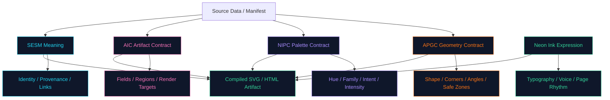

# APGC v0.1 — Artifact Panel Geometry Contract

**Status:** Draft v0.1  
**Host System:** Aptlantis Studio  
**Compatible With:** SESM v0.3.x, NIPC v0.1.x, AIC v0.1.x, Neon Ink v0.1.x
**Scope:** Manga-informed quadrilateral panel grammar, angle behavior, shape families, safe zones, responsive fallbacks, SVG/HTML geometry rules, and validation guidance for Aptlantis Studio artifacts.

---

## 1. Overview

The **Artifact Panel Geometry Contract** defines the geometry language for Aptlantis Studio interface artifacts.

Aptlantis Studio uses SVGs and HTML panels as durable visual artifacts. Existing specifications already define meaning, color, metadata, fields, layout regions, and brand expression. APGC defines the missing layer:

```text
What shape should the artifact have?
How angular may it be?
How manga-like may the composition become?
Which corners may move?
Where is text safe?
How do panels interlock?
How does geometry support reading order?
```

APGC exists because Aptlantis Studio panels are not limited to squares and rectangles. Many panels may be four-sided shapes with slanted edges, asymmetric corners, trapezoid-like forms, manga-inspired compositions, cut-corner containers, and shard accents.

The purpose of APGC is to make those shapes deterministic rather than random.

Core rule:

> **Shape communicates visual rhythm, energy, and composition. Color communicates semantic role. State controls intensity. Metadata carries meaning.**

APGC should make Aptlantis Studio feel more alive without compromising clarity, accessibility, archive-friendliness, or deterministic generation.

---

## 2. Relationship To Existing Specs

APGC is a geometry layer that sits beside SESM, NIPC, AIC, and Neon Ink.

| Layer | Spec | Responsibility |
|---|---|---|
| Meaning | SESM | Embedded metadata, asset identity, provenance, links, crawler/LLM hints |
| Palette | NIPC | Semantic color families, psychological intent, hue rules, intensity validation |
| Artifact Contract | AIC | Artifact types, required fields, layout regions, render targets, state mapping |
| Expression | Neon Ink | Brand system, typography, panel grammar, page composition, voice |
| Geometry | APGC | Shape families, corner behavior, angle energy, safe zones, panel rhythm |

APGC does not replace any existing layer. It gives generators and design agents a formal way to decide geometry.

### 2.1 What SESM Answers

SESM answers:

- What is this SVG or artifact?
- Where did it come from?
- What source data produced it?
- What theme, role, links, and provenance does it carry?
- How should agents, crawlers, and local tools interpret it?

### 2.2 What NIPC Answers

NIPC answers:

- What does the hue mean?
- Which semantic family does the color belong to?
- What psychological purpose does the color serve?
- How intense should the neon treatment be?
- Which color usages should validators warn about?

### 2.3 What AIC Answers

AIC answers:

- What artifact type is this?
- Which fields are required?
- Which regions exist?
- Which fields render into SVG, HTML, metadata, or all three?
- How does artifact state map to visual behavior?

### 2.4 What Neon Ink Answers

Neon Ink answers:

- What should Aptlantis Studio feel like?
- What typography, density, panel behavior, and page composition are appropriate?
- How should the brand express itself across the website, SVGs, decks, images, and generated artifacts?

### 2.5 What APGC Answers

APGC answers:

- What shape family should a panel use?
- How angular can a panel be?
- Which corner profile is appropriate?
- What inner safe zone preserves readability?
- How should geometry change between SVG and HTML?
- How do multiple panels form a manga-like mosaic?
- How should generators validate shape safety?

---

## 3. Goals

APGC is designed to:

1. Prevent geometry drift across generated SVG and HTML artifacts.
2. Make manga-inspired panel design deterministic and reusable.
3. Support non-rectangular four-sided panels without sacrificing readability.
4. Define shape families that communicate visual energy and composition.
5. Preserve safe text regions inside angled or asymmetric panels.
6. Support SVG-first artifact generation.
7. Provide CSS `clip-path` equivalents for HTML surfaces.
8. Give design agents and build agents explicit geometry rules.
9. Allow expressive layouts while preserving archive-grade structure.
10. Keep Neon Ink visually distinctive without becoming chaotic.

---

## 4. Non-Goals

APGC does not:

- define color semantics
- replace NIPC intensity rules
- define dataset schemas
- replace AIC artifact contracts
- replace SESM metadata
- require every artifact to be non-rectangular
- require manga-style geometry everywhere
- require JavaScript
- require animation
- define full page routing or content strategy
- make geometry the only carrier of meaning

Geometry is an expressive layer, not the source of truth.

---

## 5. Design Philosophy

### 5.1 Rectangles Are Still Valid

Aptlantis Studio should not reject rectangles.

Rectangles are useful for:

- dense data
- long text
- tables
- metadata
- stable documentation
- archive views
- low-energy utility panels

The goal is not to eliminate rectangles. The goal is to make geometry a deliberate tool.

### 5.2 Manga Energy Without Manga Confusion

Manga panel composition often uses angled quadrilaterals, irregular gutters, dynamic cuts, directional slants, and strong visual rhythm.

Aptlantis Studio should borrow the useful part:

- motion
- energy
- hierarchy
- section rhythm
- dramatic framing
- diagonal reading flow
- expressive information architecture

But it should avoid the confusing part:

- unreadable text regions
- random angles
- excessive fragmentation
- unclear reading order
- too many competing focal points

### 5.3 Shape Is Rhythm, Not Truth

A panel shape may suggest energy, motion, priority, or editorial framing. It must not be the only way a user learns critical meaning.

For example:

- A slanted panel may suggest forward motion.
- A cut corner may suggest a compiled artifact.
- A shard may draw attention.
- A trapezoid may create section identity.

But:

- Error must still be represented by semantic state and text.
- Verified status must still be represented by state and metadata.
- Archive status must still be visible or embedded.

### 5.4 Geometry Should Reduce Drift

Generated SVGs should not gradually develop unrelated styles.

A generator should not improvise:

```text
slightly random polygon
random corner cuts
random diagonal panel
random cyberpunk shape
```

It should select from APGC-defined shape families, angle profiles, safe zones, and validation rules.

---

## 6. Terminology

### Panel

A visual container that holds an artifact, section, metric, Q&A item, dataset summary, pipeline state, or brand surface.

### Artifact Panel

A panel governed by AIC and APGC. It has a known artifact type, required fields, layout regions, and geometry contract.

### Shape Family

A named geometry category such as `rect-stable`, `cut-corner`, `slant-forward`, or `manga-panel-a`.

### Shape Role

The purpose geometry plays in the composition, such as `stable-container`, `section-rhythm`, `forward-motion`, `archive-history`, or `spotlight-frame`.

### Angle Energy

A numeric measure of how visually dynamic or angular a panel is. Higher energy means stronger slants, more asymmetry, and more dramatic composition.

### Corner Profile

The rule describing how corners behave. Examples: `square`, `soft-radius`, `single-cut`, `dual-cut`, `asymmetric-soft`, `asymmetric-sharp`.

### Outer Polygon

The visible polygon or path that defines the panel boundary.

### Inner Safe Zone

The rectangular or polygonal area inside the panel where text and important UI elements may safely render.

### Bleed Zone

The outer region where decorative strokes, glows, shadows, image crops, and accents may extend.

### Gutter

The space between adjacent panels in a mosaic or page section.

### Shard

A small angular accent shape used as a badge, marker, corner fragment, or visual pointer.

### Manga Mosaic

A group of panels arranged with controlled asymmetry, varied shapes, and directional rhythm inspired by comic/manga page layouts.

---

## 7. Core Geometry Model

APGC separates geometry into five decisions:

```text
shape family
shape role
angle energy
corner profile
safe zone
```

Recommended object structure:

```json
{
  "geometry": {
    "contract": "apgc-0.1",
    "shape_family": "manga-panel-a",
    "shape_role": "section-rhythm",
    "angle_energy": 2,
    "skew_direction": "forward",
    "corner_profile": "asymmetric-soft",
    "safe_zone": {
      "type": "inset-rect",
      "x": 32,
      "y": 28,
      "width": 536,
      "height": 164
    },
    "responsive_fallback": "soft-card"
  }
}
```

---

## 8. Shape Families

Shape family is the primary geometry classification.

### 8.1 Canonical Shape Families

```json
{
  "shape_families": [
    "rect-stable",
    "soft-card",
    "cut-corner",
    "slant-forward",
    "slant-back",
    "trapezoid-wide",
    "trapezoid-tall",
    "manga-panel-a",
    "manga-panel-b",
    "manga-panel-c",
    "shard",
    "burst"
  ]
}
```

### 8.2 Shape Family Table

| Shape Family | Energy Range | Meaning | Best Use |
|---|---:|---|---|
| `rect-stable` | 0 | Stability, neutrality, dense readability | Docs, tables, metadata, long text |
| `soft-card` | 0–1 | Friendly artifact card | Dataset cards, Q&A items, ordinary panels |
| `cut-corner` | 1–2 | Technical, compiled, artifact-like | Schema cards, download cards, generated artifacts |
| `slant-forward` | 1–3 | Motion, progress, next step | Pipelines, navigation, process flow |
| `slant-back` | 1–3 | History, archive, reflection | Changelog, snapshots, prior versions |
| `trapezoid-wide` | 1–3 | Section identity, banner energy | Headers, hero strips, category panels |
| `trapezoid-tall` | 1–3 | Vertical rail, sidebar energy | Sidebars, section rails, tall graphics |
| `manga-panel-a` | 2–3 | Dynamic but readable | Featured sections, section mosaics |
| `manga-panel-b` | 3–4 | Strong asymmetry | Hero mosaics, visual-first panels |
| `manga-panel-c` | 4 | Dramatic composition | Rare campaign or splash surfaces |
| `shard` | 1–4 | Small angular accent | Badges, labels, pointer marks |
| `burst` | 4–5 | Interrupt, spotlight, dramatic emphasis | Rare hero/alert graphics only |

---

## 9. Angle Energy Scale

Angle energy controls how far geometry departs from a calm rectangle.

| Energy | Name | Description | Allowed Use |
|---:|---|---|---|
| 0 | Rectangular | Stable, grid-aligned, quiet | Dense content, docs, metadata |
| 1 | Technical Cut | Slightly shaped, artifact-like | Cards, schema panels, downloads |
| 2 | Editorial Slant | Manga/comic rhythm, still readable | Q&A, feature cards, process panels |
| 3 | Dynamic Panel | Strong motion and asymmetry | Visual sections, hero support panels |
| 4 | Dramatic Panel | High-energy composition | Hero mosaics, marketing surfaces |
| 5 | Rupture | Visual interrupt | Rare alerts, splash graphics, never dense text |

### 9.1 Energy Rules

```text
Dense text:        0–2
Stats tiles:       0–2
Dataset cards:     0–2
Pipeline panels:   1–3
Q&A items:         0–2
Hero mosaics:      2–4
Marketing art:     3–5
Error panels:      1–2
Archive panels:    0–2
```

### 9.2 Maximum Energy Rule

No artifact with long body text should exceed `angle_energy: 2` unless the text is contained inside a verified inner safe zone.

---

## 10. Directional Semantics

Geometry may imply direction, but it must remain secondary to explicit labels, color, state, and metadata.

### 10.1 Skew Direction Values

```json
{
  "skew_direction": [
    "none",
    "forward",
    "back",
    "upward",
    "downward",
    "inward",
    "outward",
    "mixed"
  ]
}
```

### 10.2 Recommended Direction Meanings

| Direction | Meaning | Use |
|---|---|---|
| `none` | Stable, neutral | Docs, metadata, calm cards |
| `forward` | Continue, progress, next step | Pipelines, navigation, actions |
| `back` | History, prior state, archive | Snapshots, changelog, older releases |
| `upward` | Growth, elevation, spotlight | Featured metrics, improvement |
| `downward` | Drill-down, detail, caution | Expanded details, caveats |
| `inward` | Focus, convergence | Summary, synthesis, canonical answer |
| `outward` | Expansion, discovery | Explore sections, related links |
| `mixed` | Manga composition rhythm | Hero mosaics only |

### 10.3 Left-To-Right Bias

For English-language Aptlantis Studio pages, forward motion should generally guide the eye from:

```text
top-left -> center -> lower-right
```

Backward motion may be used for archive or historical surfaces, but should not fight the main reading order.

---

## 11. Corner Profiles

Corner profile defines how corners are shaped.

### 11.1 Canonical Corner Profiles

```json
{
  "corner_profiles": [
    "square",
    "soft-radius",
    "single-cut",
    "dual-cut",
    "opposite-cut",
    "all-cut",
    "asymmetric-soft",
    "asymmetric-sharp",
    "manga-irregular",
    "shard-cut"
  ]
}
```

### 11.2 Corner Profile Table

| Corner Profile | Meaning | Best Use |
|---|---|---|
| `square` | Stable, plain, archival | Docs, tables, metadata |
| `soft-radius` | Friendly, approachable | Cards, Q&A, dataset previews |
| `single-cut` | Technical accent | Badges, cards, utility panels |
| `dual-cut` | Stronger artifact feel | Download cards, schema cards |
| `opposite-cut` | Motion and balance | Navigation/process panels |
| `all-cut` | Compiled artifact container | Highly technical panels |
| `asymmetric-soft` | Manga-like but readable | Feature cards, section panels |
| `asymmetric-sharp` | Higher drama | Hero support panels |
| `manga-irregular` | Full manga composition | Visual mosaics |
| `shard-cut` | Accent fragment | Small labels, corner flags |

### 11.3 Corner Offset Limits

Recommended corner offset limits by artifact density:

| Density | Max Corner Offset |
|---|---:|
| dense | 12px |
| compact | 20px |
| standard | 32px |
| spacious | 48px |
| hero | 72px |
| visual-only | 120px |

Generator rule:

> Corner offset must never intrude into the inner safe zone.

---

## 12. Safe Zones

Safe zones are mandatory for non-rectangular panels that contain text, numbers, controls, or important icons.

### 12.1 Safe Zone Types

```json
{
  "safe_zone_types": [
    "full-rect",
    "inset-rect",
    "inset-polygon",
    "center-band",
    "title-band",
    "stat-grid",
    "visual-only"
  ]
}
```

### 12.2 Safe Zone Table

| Safe Zone | Description | Use |
|---|---|---|
| `full-rect` | Entire panel is text-safe | Rectangular panels |
| `inset-rect` | Inner rectangle inside shaped panel | Most artifact panels |
| `inset-polygon` | Text-safe polygon | Advanced SVG panels |
| `center-band` | Horizontal safe band | Hero banners, title strips |
| `title-band` | Header/title-safe area only | Visual-first panels |
| `stat-grid` | Grid-safe regions for numbers | Stats panels |
| `visual-only` | No text safety guaranteed | Decorative images, abstract shards |

### 12.3 Required Safe Zone Object

```json
{
  "safe_zone": {
    "type": "inset-rect",
    "x": 32,
    "y": 28,
    "width": 536,
    "height": 164,
    "min_text_margin": 24,
    "preserve_reading_order": true
  }
}
```

### 12.4 Safe Zone Rules

1. Text may not render outside the safe zone.
2. Click targets may extend outside the safe zone only if visible focus states remain clear.
3. Decorative glow may enter the bleed zone, but not reduce text contrast.
4. Badges may sit partly outside the safe zone if they remain readable.
5. Panels with `visual-only` safe zones must not contain essential text.

---

## 13. Bleed, Stroke, Glow, And Shadow

APGC controls where geometry effects may extend.

### 13.1 Layer Model

```text
outer canvas
  bleed zone
    outer polygon / visible shape
      stroke zone
        inner fill
          safe zone
```

### 13.2 Bleed Zone Object

```json
{
  "bleed": {
    "outer": 12,
    "allow_glow": true,
    "allow_shadow": true,
    "allow_crop": false
  }
}
```

### 13.3 Glow Rule

Glow belongs to state and intensity rules, not arbitrary geometry.

APGC defines where glow may appear. NIPC/AIC define why glow appears.

### 13.4 Stroke Rule

Angled panels should usually use one of these stroke styles:

```json
{
  "stroke_styles": [
    "single-line",
    "double-line",
    "inner-hairline",
    "corner-accent",
    "broken-technical",
    "none"
  ]
}
```

Recommended defaults:

| Shape Family | Stroke Style |
|---|---|
| `rect-stable` | `single-line` or `none` |
| `soft-card` | `single-line` |
| `cut-corner` | `corner-accent` |
| `slant-forward` | `single-line` or `inner-hairline` |
| `manga-panel-a` | `double-line` or `corner-accent` |
| `manga-panel-b` | `double-line` |
| `shard` | `single-line` |
| `burst` | `broken-technical` |

---

## 14. SVG Geometry Rules

SVG is the canonical render target for APGC because Aptlantis Studio treats many interface units as compiled SVG artifacts.

### 14.1 Preferred SVG Primitives

Use:

- `<polygon>` for simple four-sided shapes
- `<path>` for cut-corner or mixed geometry
- `<clipPath>` for image/content masks
- `<mask>` only when necessary
- `<metadata>` for SESM/APGC embedding

### 14.2 Quadrilateral Polygon Format

APGC quadrilateral points should be expressed in clockwise order:

```json
{
  "outer_polygon": [
    [0, 16],
    [580, 0],
    [600, 204],
    [20, 220]
  ]
}
```

Clockwise order:

```text
top-left -> top-right -> bottom-right -> bottom-left
```

### 14.3 SVG Example

```xml
<svg viewBox="0 0 600 220" xmlns="http://www.w3.org/2000/svg" role="img" aria-labelledby="title desc">
  <title id="title">Example Manga Panel</title>
  <desc id="desc">A dynamic Aptlantis Studio artifact panel using APGC geometry.</desc>

  <metadata id="sesm"><![CDATA[
  {
    "sesm_version": "0.3.0",
    "asset": {
      "id": "example-manga-panel",
      "role": "dataset-card",
      "title": "Example Manga Panel"
    },
    "ui": {
      "component_type": "panel",
      "preferred_layout": "manga-artifact-panel",
      "geometry_contract": "apgc-0.1"
    },
    "extra": {
      "vendor": {
        "aptlantis": {
          "apgc": {
            "contract": "apgc-0.1",
            "shape_family": "manga-panel-a",
            "shape_role": "section-rhythm",
            "angle_energy": 2,
            "skew_direction": "forward",
            "corner_profile": "asymmetric-soft",
            "safe_zone": {
              "type": "inset-rect",
              "x": 32,
              "y": 28,
              "width": 536,
              "height": 164
            }
          }
        }
      }
    }
  }
  ]]></metadata>

  <defs>
    <clipPath id="panelClip">
      <polygon points="0,16 580,0 600,204 20,220" />
    </clipPath>
  </defs>

  <polygon points="0,16 580,0 600,204 20,220" fill="#111827" stroke="#22D3EE" stroke-width="2" />
  <rect x="32" y="28" width="536" height="164" fill="none" stroke="#64748B" stroke-dasharray="4 6" opacity="0.25" />
</svg>
```

### 14.4 Safe Zone Debug Mode

Generators should support a debug mode that renders safe zones visibly.

Recommended debug styling:

```text
safe zone stroke: muted slate
safe zone opacity: 0.2–0.35
safe zone fill: none
corner control points: small dots
```

Debug safe zones must not appear in production artifacts unless intentionally documented.

---

## 15. HTML/CSS Geometry Rules

HTML panels may use CSS `clip-path` when appropriate.

### 15.1 CSS Clip Path Example

```css
.apgc-manga-panel-a {
  clip-path: polygon(0% 7%, 96.7% 0%, 100% 92.7%, 3.3% 100%);
}
```

### 15.2 HTML Fallback Rule

Every clipped HTML panel must have a fallback shape.

```json
{
  "responsive_fallback": "soft-card"
}
```

Fallbacks are required because CSS clipping can create text, focus, overflow, and accessibility problems on small screens.

### 15.3 Recommended Breakpoint Behavior

| Width | Geometry Behavior |
|---:|---|
| `>= 1200px` | Full geometry allowed |
| `900–1199px` | Moderate geometry, reduce offsets by 20% |
| `640–899px` | Reduce offsets by 40%, preserve safe zone |
| `< 640px` | Fallback to `soft-card` or `rect-stable` |

### 15.4 Focus Rule

If a clipped panel contains links or buttons, focus outlines must remain visible and must not be clipped beyond recognition.

Recommended solution:

```text
Outer wrapper receives focus outline.
Inner clipped panel receives shape.
```

---

## 16. Shape Selection By Artifact Type

APGC should be referenced by AIC artifact contracts.

### 16.1 Recommended Mapping

| AIC Artifact Type | Default Shape | Allowed Shape Families | Max Energy |
|---|---|---|---:|
| `dataset-card` | `soft-card` | `soft-card`, `cut-corner`, `manga-panel-a` | 2 |
| `dataset-header` | `trapezoid-wide` | `rect-stable`, `trapezoid-wide`, `manga-panel-a` | 3 |
| `pipeline-panel` | `slant-forward` | `cut-corner`, `slant-forward`, `manga-panel-a` | 3 |
| `qa-item` | `soft-card` | `soft-card`, `cut-corner`, `slant-forward` | 2 |
| `stats-tile` | `rect-stable` | `rect-stable`, `soft-card`, `cut-corner` | 2 |
| `theme-board` | `manga-panel-a` | `trapezoid-wide`, `manga-panel-a`, `manga-panel-b` | 4 |
| `download-card` | `cut-corner` | `cut-corner`, `slant-forward` | 2 |
| `schema-card` | `cut-corner` | `rect-stable`, `cut-corner` | 2 |
| `navigation-card` | `slant-forward` | `soft-card`, `slant-forward`, `shard` | 3 |
| `archive-summary` | `slant-back` | `rect-stable`, `soft-card`, `slant-back` | 2 |
| `brand-promo-panel` | `manga-panel-b` | `manga-panel-a`, `manga-panel-b`, `burst` | 5 |

### 16.2 Artifact Contract Example

```json
{
  "artifact_type": "pipeline-panel",
  "layout": {
    "regions": ["title", "stage_list", "status", "timestamp", "actions"],
    "geometry_contract": "apgc-0.1",
    "shape_family": "slant-forward",
    "safe_zone_required": true
  }
}
```

---

## 17. Shape Selection By Semantic Role

Shape does not replace color, but geometry may reinforce semantic role.

### 17.1 Recommended Semantic Reinforcement

| Semantic Role / Family | Geometry Reinforcement |
|---|---|
| `info`, `structure`, `reference` | Rectangular, soft-card, light cut corners |
| `process`, `pipeline`, `automation` | Forward slants, trapezoids, directional gutters |
| `success`, `verified`, `reproducible` | Stable shape, small confident badge/shard |
| `important`, `note`, `decision` | Small shard, rail, folded-corner marker |
| `critical`, `error`, `blocked` | Controlled cut-corner, never excessive burst by default |
| `code-heat`, `build`, `operation` | Cut corners, technical notches, orange corner accent |
| `featured`, `creative`, `discovery` | Manga panels, spotlight frames, asymmetric layouts |
| `experimental`, `research`, `prototype` | Indigo slants, split panels, hypothesis frames |
| `archive`, `canonical`, `muted` | Rect-stable, slant-back, low-energy geometry |

### 17.2 Critical Restraint Rule

Red and high angularity should rarely combine.

Reason:

```text
Red already signals interrupt/risk.
Extreme geometry also signals interrupt/risk.
Together they can become visually hostile.
```

Default for critical panels:

```json
{
  "shape_family": "cut-corner",
  "angle_energy": 1,
  "corner_profile": "single-cut"
}
```

Use `burst` only for rare, high-level alert graphics.

### 17.3 Yellow Marker Rule

Yellow/attention panels should usually use geometry as a marker, not a large container.

Preferred:

```text
left rail
small shard
folded corner
index marker
badge
underline
```

Avoid:

```text
large yellow backgrounds
full-panel yellow glow
multiple yellow shards in one dense view
```

---

## 18. Manga Mosaic Composition

A manga mosaic is a group of APGC panels arranged as a section, hero, or visual explainer.

### 18.1 Mosaic Goals

A mosaic should:

1. Create visual rhythm.
2. Preserve reading order.
3. Vary panel scale intentionally.
4. Use asymmetry without randomness.
5. Keep text-safe areas predictable.
6. Use gutters as part of the composition.
7. Avoid competing focal points.

### 18.2 Mosaic Object

```json
{
  "mosaic": {
    "contract": "apgc-0.1",
    "layout_family": "manga-grid-a",
    "reading_order": "top-left-to-bottom-right",
    "gutter": 16,
    "max_angle_energy": 3,
    "panels": [
      {
        "id": "hero-main",
        "shape_family": "manga-panel-b",
        "angle_energy": 3,
        "role": "primary"
      },
      {
        "id": "supporting-stat",
        "shape_family": "cut-corner",
        "angle_energy": 1,
        "role": "support"
      }
    ]
  }
}
```

### 18.3 Mosaic Layout Families

```json
{
  "mosaic_layout_families": [
    "manga-grid-a",
    "manga-grid-b",
    "hero-split-diagonal",
    "rail-and-stack",
    "center-burst-supports",
    "archive-strip",
    "pipeline-flow"
  ]
}
```

### 18.4 Manga Grid A

Use for balanced feature sections.

```text
large primary panel left/top
2–4 supporting panels right/bottom
moderate slants
clear safe zones
```

### 18.5 Manga Grid B

Use for more energetic sections.

```text
large angled hero panel
support panels of varied height
stronger diagonal gutters
limited body text
```

### 18.6 Hero Split Diagonal

Use for page headers and landing surfaces.

```text
left identity block
right visual/artifact block
diagonal divider or angled boundary
center-band safe zone
```

### 18.7 Rail And Stack

Use for sections with left/right navigation.

```text
thin vertical trapezoid rail
stacked rectangular or soft-card content panels
small shards for status markers
```

### 18.8 Center Burst Supports

Use rarely.

```text
central spotlight artifact
small surrounding shards or stat panels
high energy but low text density
```

### 18.9 Archive Strip

Use for timelines, snapshots, and changelogs.

```text
mostly rectangular panels
slant-back accents
muted geometry
horizontal reading flow
```

### 18.10 Pipeline Flow

Use for pipeline explanations.

```text
forward slanted stage panels
violet process accents
orange execution shards
green verification endpoint
```

---

## 19. Reading Order Rules

### 19.1 Explicit Reading Order

Mosaics must declare reading order when panels are not simple rows.

```json
{
  "reading_order": [
    "hero-main",
    "metric-records",
    "pipeline-summary",
    "download-action"
  ]
}
```

### 19.2 Visual Order And DOM Order

For HTML surfaces, DOM order should follow reading order even if CSS places panels visually.

For SVG surfaces, SESM or APGC metadata should preserve intended reading order.

### 19.3 Directional Gutters

Diagonal gutters may point the eye, but they should not create ambiguous paths.

Avoid layouts where the strongest diagonal points away from the next intended panel.

---

## 20. Density Rules

Geometry must respond to information density.

### 20.1 Density Levels

```json
{
  "density": [
    "dense",
    "compact",
    "standard",
    "spacious",
    "hero",
    "visual-only"
  ]
}
```

### 20.2 Density Constraints

| Density | Text Amount | Max Energy | Safe Zone Requirement |
|---|---|---:|---|
| `dense` | High | 1 | Required |
| `compact` | Medium | 2 | Required |
| `standard` | Medium | 2 | Required |
| `spacious` | Low/medium | 3 | Required |
| `hero` | Low | 4 | Required for text |
| `visual-only` | None/very low | 5 | Optional |

### 20.3 Long Text Rule

Any panel with body text longer than 240 characters should use:

```json
{
  "shape_family": "rect-stable or soft-card",
  "angle_energy": 0-1
}
```

Exception: a larger `manga-panel-a` may be used if the safe zone is rectangular and large enough.

---

## 21. Responsive Behavior

### 21.1 Fallback Families

Every APGC shape should define a fallback for narrow screens.

| Original Shape | Recommended Fallback |
|---|---|
| `rect-stable` | `rect-stable` |
| `soft-card` | `soft-card` |
| `cut-corner` | `soft-card` |
| `slant-forward` | `soft-card` |
| `slant-back` | `soft-card` |
| `trapezoid-wide` | `soft-card` or `rect-stable` |
| `trapezoid-tall` | `rect-stable` |
| `manga-panel-a` | `soft-card` |
| `manga-panel-b` | `soft-card` |
| `manga-panel-c` | `rect-stable` |
| `shard` | `badge` |
| `burst` | `badge` or `soft-card` |

### 21.2 Small Screen Rule

Below 640px, text-bearing panels should usually become `soft-card` or `rect-stable`.

### 21.3 SVG Scaling Rule

SVG panels should preserve aspect ratio unless the artifact contract explicitly allows cropping.

Recommended SESM/UI hint:

```json
{
  "responsive_behavior": "preserve-aspect-ratio"
}
```

For text-heavy SVGs:

```json
{
  "responsive_behavior": "preserve-safe-zone"
}
```

---

## 22. Accessibility Rules

### 22.1 Geometry Must Not Reduce Readability

Non-rectangular panels must preserve:

- text contrast
- focus visibility
- reading order
- target size
- label clarity
- minimum margins

### 22.2 Do Not Encode Critical Meaning Only In Shape

A user should not need to perceive shape differences to understand:

- error
- warning
- success
- archive
- verified
- deprecated
- unavailable

These must be communicated by text, state, ARIA where relevant, metadata, and NIPC semantic color.

### 22.3 Motion Sensitivity

APGC may define geometry for motion-like panels, but actual animation belongs to state/intensity rules and must respect reduced-motion preferences.

---

## 23. Validation Rules

Generators should validate APGC fields before output.

### 23.1 Required Fields

For production artifacts using APGC:

```json
{
  "required": [
    "contract",
    "shape_family",
    "angle_energy",
    "corner_profile",
    "safe_zone",
    "responsive_fallback"
  ]
}
```

For decorative assets, `safe_zone` may be `visual-only`.

### 23.2 Validation Checks

A validator should check:

1. `shape_family` is known.
2. `angle_energy` is within allowed range for the shape family.
3. `angle_energy` is within allowed range for the artifact type.
4. Safe zone exists for text-bearing panels.
5. Corner offsets do not intrude into safe zone.
6. Text regions fit within safe zone.
7. Responsive fallback exists.
8. Reading order exists for mosaics.
9. Critical/error panels do not exceed recommended geometry energy unless explicitly overridden.
10. Visual-only panels do not contain essential text.

### 23.3 Warning Conditions

Warnings should be emitted for:

```text
high angle energy + dense text
red semantic role + burst geometry
yellow full-panel container
missing safe zone debug data
shape_family not aligned with artifact type
clip-path panel without focus fallback
mosaic without reading_order
corner offset greater than density limit
```

### 23.4 Failure Conditions

Production generation should fail if:

```text
required geometry fields are missing
text-bearing polygon has no safe zone
angle_energy exceeds shape family maximum
angle_energy exceeds artifact maximum without override
outer polygon is invalid
safe zone has negative or impossible dimensions
responsive fallback is missing for HTML clip-path panels
```

---

## 24. Override Policy

APGC should allow explicit overrides, but they must be visible in metadata.

```json
{
  "geometry_override": {
    "enabled": true,
    "reason": "hero campaign image, visual-only, no essential body text",
    "approved_by": "design-system"
  }
}
```

Override should be rare.

Recommended reasons:

- hero campaign visual
- one-off infographic
- decorative splash asset
- experimental theme board
- archived legacy mockup

---

## 25. APGC Metadata Placement

APGC fields may appear in:

1. AIC artifact contract files
2. SESM `ui` hints
3. SESM vendor extension fields
4. generator templates
5. JSON/TOML theme configuration
6. SVG `<metadata>` blocks

### 25.1 Minimal SESM Integration

```json
{
  "ui": {
    "component_type": "panel",
    "preferred_layout": "manga-artifact-panel",
    "geometry_contract": "apgc-0.1",
    "shape_family": "slant-forward",
    "responsive_behavior": "preserve-safe-zone"
  }
}
```

### 25.2 Full Vendor Extension

```json
{
  "extra": {
    "vendor": {
      "aptlantis": {
        "apgc": {
          "contract": "apgc-0.1",
          "shape_family": "manga-panel-a",
          "shape_role": "section-rhythm",
          "angle_energy": 2,
          "skew_direction": "forward",
          "corner_profile": "asymmetric-soft",
          "outer_polygon": [[0,16],[580,0],[600,204],[20,220]],
          "safe_zone": {
            "type": "inset-rect",
            "x": 32,
            "y": 28,
            "width": 536,
            "height": 164
          },
          "responsive_fallback": "soft-card"
        }
      }
    }
  }
}
```

---

## 26. Template Naming Conventions

APGC-compatible templates should use stable names.

Recommended pattern:

```text
{artifact_type}.{shape_family}.{density}.svg.tmpl
```

Examples:

```text
dataset-card.soft-card.compact.svg.tmpl
dataset-card.cut-corner.compact.svg.tmpl
pipeline-panel.slant-forward.standard.svg.tmpl
theme-board.manga-panel-a.spacious.svg.tmpl
hero.manga-panel-b.hero.svg.tmpl
qa-item.soft-card.compact.svg.tmpl
```

### 26.1 Shape Token Naming

Shape tokens should be lowercase and hyphen-separated.

Use:

```text
manga-panel-a
slant-forward
cut-corner
rect-stable
```

Avoid:

```text
MangaPanelA
weirdPanel
coolCyberShape
panel_angled_thing
```

---

## 27. Recommended Polygon Presets

These presets assume a `600x220` viewBox.

### 27.1 `rect-stable`

```json
{
  "outer_polygon": [[0,0],[600,0],[600,220],[0,220]],
  "safe_zone": { "x": 24, "y": 24, "width": 552, "height": 172 }
}
```

### 27.2 `cut-corner`

```json
{
  "outer_polygon": [[0,0],[576,0],[600,24],[600,220],[24,220],[0,196]],
  "safe_zone": { "x": 32, "y": 28, "width": 536, "height": 164 }
}
```

### 27.3 `slant-forward`

```json
{
  "outer_polygon": [[24,0],[600,0],[576,220],[0,220]],
  "safe_zone": { "x": 48, "y": 26, "width": 504, "height": 168 }
}
```

### 27.4 `slant-back`

```json
{
  "outer_polygon": [[0,0],[576,0],[600,220],[24,220]],
  "safe_zone": { "x": 48, "y": 26, "width": 504, "height": 168 }
}
```

### 27.5 `trapezoid-wide`

```json
{
  "outer_polygon": [[36,0],[564,0],[600,220],[0,220]],
  "safe_zone": { "x": 56, "y": 30, "width": 488, "height": 160 }
}
```

### 27.6 `manga-panel-a`

```json
{
  "outer_polygon": [[0,16],[580,0],[600,204],[20,220]],
  "safe_zone": { "x": 36, "y": 30, "width": 528, "height": 158 }
}
```

### 27.7 `manga-panel-b`

```json
{
  "outer_polygon": [[20,0],[600,28],[560,220],[0,192]],
  "safe_zone": { "x": 56, "y": 42, "width": 488, "height": 136 }
}
```

### 27.8 `shard`

```json
{
  "outer_polygon": [[0,8],[92,0],[108,32],[14,40]],
  "safe_zone": { "x": 14, "y": 8, "width": 78, "height": 24 }
}
```

---

## 28. Implementation Notes For Generators

### 28.1 Generator Inputs

A generator should receive:

```json
{
  "artifact_type": "dataset-card",
  "density": "compact",
  "semantic_role": "code-heat",
  "state": "active",
  "geometry": {
    "shape_family": "cut-corner",
    "angle_energy": 1
  }
}
```

### 28.2 Generator Resolution Order

Recommended resolution order:

```text
1. Read artifact type from AIC.
2. Read semantic role and state from NIPC/AIC/SESM data.
3. Determine allowed shape families for artifact type.
4. Determine density.
5. Choose shape family.
6. Clamp angle energy to allowed range.
7. Select corner profile.
8. Calculate outer polygon.
9. Calculate inner safe zone.
10. Validate text regions.
11. Render SVG or HTML.
12. Embed APGC metadata.
```

### 28.3 Determinism Rule

Given the same:

```text
source data
artifact type
theme version
shape family
angle energy
viewBox
```

The generator should produce the same geometry every time unless a seed or override is explicitly provided.

### 28.4 Seeded Variation

Controlled variation may be used for mosaics.

```json
{
  "geometry_seed": "about-page-section-qa-001"
}
```

Seeded variation may alter:

- small corner offsets
- panel ordering within allowed layout family
- shard placement
- gutter rhythm

Seeded variation may not alter:

- required fields
- semantic role
- state
- reading order
- safe zone validity

---

## 29. Page Section Guidance

### 29.1 About / Q&A Pages

Recommended:

```json
{
  "artifact_type": "qa-item",
  "shape_family": "soft-card",
  "angle_energy": 0-1,
  "attention_marker": "shard or rail"
}
```

Use small colored indicators for semantic category. Avoid dramatic geometry for every item.

### 29.2 Pipeline Pages

Recommended:

```json
{
  "artifact_type": "pipeline-panel",
  "shape_family": "slant-forward",
  "angle_energy": 2,
  "skew_direction": "forward"
}
```

Use forward motion to imply staged progress.

### 29.3 Dataset Pages

Recommended:

```json
{
  "artifact_type": "dataset-header",
  "shape_family": "trapezoid-wide",
  "angle_energy": 2
}
```

Dataset cards can remain calmer:

```json
{
  "artifact_type": "dataset-card",
  "shape_family": "soft-card or cut-corner",
  "angle_energy": 0-1
}
```

### 29.4 Theme Boards

Recommended:

```json
{
  "artifact_type": "theme-board",
  "shape_family": "manga-panel-a",
  "angle_energy": 2-3
}
```

Theme boards may use more expressive geometry because they demonstrate the visual system.

### 29.5 Marketing / Hero Sections

Recommended:

```json
{
  "shape_family": "manga-panel-b",
  "angle_energy": 3-4,
  "safe_zone": "center-band or title-band"
}
```

Avoid long paragraphs inside high-energy hero panels.

---

## 30. Opinionated Defaults

APGC v0.1 recommends these defaults:

```text
1. Default panels are rectangles or soft cards.
2. Important panels may use cut corners.
3. Process/navigation panels may slant forward.
4. Archive/history panels may slant backward.
5. Hero mosaics may use manga-panel variants.
6. Dense text must always preserve an inner rectangular safe zone.
7. Extreme angles are only for mostly visual artifacts.
8. Geometry must never be the only carrier of meaning.
9. Color meaning comes from NIPC.
10. Artifact structure comes from AIC.
11. Embedded meaning comes from SESM.
12. Brand expression comes from Neon Ink.
13. Visual rhythm comes from APGC.
```

---

## 31. Mermaid Architecture Diagram



---

## 32. Minimal APGC Contract Example

```json
{
  "apgc_version": "0.1.0",
  "artifact_type": "dataset-card",
  "shape_family": "cut-corner",
  "shape_role": "artifact-container",
  "angle_energy": 1,
  "skew_direction": "none",
  "corner_profile": "single-cut",
  "outer_shape": "polygon",
  "outer_polygon": [[0,0],[576,0],[600,24],[600,220],[24,220],[0,196]],
  "safe_zone": {
    "type": "inset-rect",
    "x": 32,
    "y": 28,
    "width": 536,
    "height": 164,
    "min_text_margin": 24
  },
  "bleed": {
    "outer": 12,
    "allow_glow": true,
    "allow_shadow": true
  },
  "responsive_fallback": "soft-card",
  "validation": {
    "preserve_reading_order": true,
    "max_corner_offset": 24,
    "requires_safe_zone": true
  }
}
```

---

## 33. Full Artifact Integration Example

```json
{
  "aic_version": "0.1.0",
  "artifact_type": "pipeline-panel",
  "required": ["pipeline_id", "state", "stage_list", "updated"],
  "layout": {
    "regions": ["title", "stage_list", "status", "timestamp", "actions"],
    "density": "standard",
    "geometry_contract": "apgc-0.1",
    "safe_zone_required": true
  },
  "theme": {
    "id": "neon-ink",
    "semantic_role": "pipeline",
    "semantic_family": "process-transformation",
    "state": "running",
    "intensity": 3
  },
  "geometry": {
    "contract": "apgc-0.1",
    "shape_family": "slant-forward",
    "shape_role": "forward-motion",
    "angle_energy": 2,
    "skew_direction": "forward",
    "corner_profile": "opposite-cut",
    "safe_zone": {
      "type": "inset-rect",
      "x": 48,
      "y": 26,
      "width": 504,
      "height": 168
    },
    "responsive_fallback": "soft-card"
  }
}
```

---

## 34. Versioning

APGC should use semantic versioning.

```text
MAJOR: breaking shape contract changes
MINOR: new shape families, optional metadata, additive validation
PATCH: wording, examples, clarifications
```

For this draft:

```json
{
  "apgc_version": "0.1.0"
}
```

---

## 35. Summary

APGC makes shape a first-class part of the Aptlantis Studio design system.

It allows the system to use manga-informed quadrilateral panels, slants, cuts, shards, trapezoids, and mosaics without drifting into arbitrary decoration.

The final separation of responsibilities is:

```text
SESM = embedded meaning
NIPC = color meaning
AIC = artifact structure
Neon Ink = brand expression
APGC = geometry rhythm
```

APGC should let Aptlantis Studio become more visually distinctive while remaining deterministic, accessible, static-friendly, archive-aware, and generator-ready.
