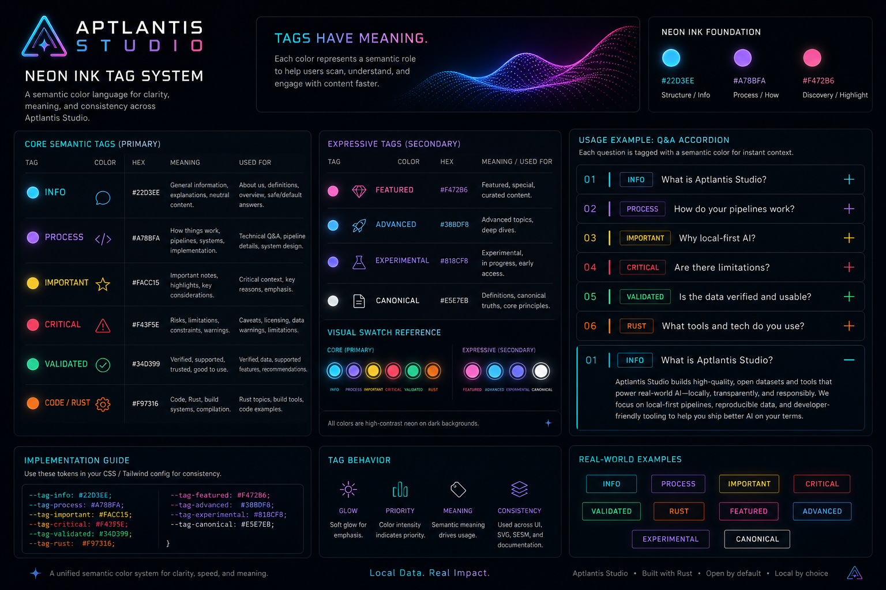

#Neon Ink Tag Theme

> **NIPC alignment note:** This tag-theme note is a pre-NIPC source reference. Its core idea that tag colors carry meaning is now canonicalized in `NIPC—NeonInkPaletteContract.md`, including expanded color families, psychological intent, intensity, and validation rules.

> **Tag Colors = Meaning + Behavior + Visual Identity**

<p align="center">
  
</p>

<p align="center">
  
</p>

---

# 🎯 Design Goal

You want tags that:

* pop visually (neon)
* feel consistent with Neon Ink
* carry meaning across pages (About, datasets, pipelines, docs)
* plug into your generator later

---

# 🧬 System Structure

Each tag has:

```plaintext
NAME → HEX → ROLE → USAGE
```

And optionally later:

```plaintext
state → glow → priority → SESM tag
```

---

# 🌈 Palette Set 1 — **Core Semantic Tags**

These are your *primary system-level tags*

## 🔹 Neon Blue — “Info / General”

```plaintext
#22D3EE
```

**Meaning:**

* general info
* explanations
* safe/default

**Use:**

* “What is Aptlantis Studio?”
* neutral Q&A
* docs references

---

## 🟣 Neon Violet — “Process / How”

```plaintext
#A78BFA
```

**Meaning:**

* pipelines
* systems
* implementation details

**Use:**

* “How does the pipeline work?”
* technical Q&A

---

## 🟡 Neon Yellow — “Important / Attention”

```plaintext
#FACC15
```

**Meaning:**

* important notes
* caveats
* highlights

**Use:**

* “Why local-first matters”
* warnings / emphasis

---

## 🔴 Neon Red — “Critical / Risk / Constraint”

```plaintext
#F43F5E
```

**Meaning:**

* limitations
* constraints
* failures / risks

**Use:**

* licensing caveats
* dataset warnings

---

## 🟢 Neon Green — “Validated / Good”

```plaintext
#34D399
```

**Meaning:**

* verified
* recommended
* production-ready

**Use:**

* “Is this dataset usable?”
* “Yes / supported”

---

## 🟠 Neon Orange — “Code / Rust / Build”

```plaintext
#F97316
```

**Meaning:**

* Rust
* compilation
* code-heavy topics

**Use:**

* Rust datasets
* pipeline internals

---

# 🌈 Palette Set 2 — **Expressive / Creative Tags**

These give you more flavor for Studio-specific content

---

## 💗 Neon Magenta — “Featured / Highlight”

```plaintext
#F472B6
```

**Meaning:**

* featured
* special
* creative datasets

---

## 🔵 Deep Neon Blue — “Advanced / Deep Dive”

```plaintext
#38BDF8
```

**Meaning:**

* deeper explanations
* advanced technical content

---

## 🟪 Electric Indigo — “Experimental”

```plaintext
#818CF8
```

**Meaning:**

* experimental pipelines
* in-progress ideas

---

## ⚪ Neon White — “Definition / Canonical”

```plaintext
#E5E7EB
```

**Meaning:**

* definitions
* core statements
* canonical explanations

---

# 🧱 Visual Swatch Layout (for your theme boards)

You’ll want them grouped like this:

---

## Core System Tags

```plaintext
[ CYAN ]   [ VIOLET ]   [ YELLOW ]
[ RED  ]   [ GREEN  ]   [ ORANGE ]
```

---

## Expressive Layer

```plaintext
[ MAGENTA ] [ BLUE ] [ INDIGO ] [ WHITE ]
```

---

# 🧠 Tag Behavior (This is the magic layer)

Instead of just color, define behavior:

---

## Example Tag Object

```json
{
  "tag": "process",
  "color": "#A78BFA",
  "glow": "soft",
  "priority": "medium",
  "usage": ["pipelines", "how-it-works"]
}
```

---

# 💡 Q&A Page Application

## Example

```plaintext
[01] WHAT IS APTLANTIS STUDIO?
Tag: INFO (cyan)

[02] HOW DO YOUR PIPELINES WORK?
Tag: PROCESS (violet)

[03] WHY LOCAL-FIRST?
Tag: IMPORTANT (yellow)

[04] ARE THERE LIMITATIONS?
Tag: CRITICAL (red)

[05] IS THIS DATA VERIFIED?
Tag: VALIDATED (green)
```

---

## Visual Pattern

Each accordion row:

* left: number
* next: colored tag indicator (small bar or dot)
* title text
* right: + / − icon

---

# 🎨 CSS / Tailwind Token Idea

```js
// tailwind.config.js
colors: {
  studio: {
    cyan: "#22D3EE",
    violet: "#A78BFA",
    yellow: "#FACC15",
    red: "#F43F5E",
    green: "#34D399",
    orange: "#F97316",
    magenta: "#F472B6"
  }
}
```

---

# 🧬 Future (SESM Integration)

Each Q&A block could eventually include:

```json
{
  "tag": "process",
  "semantic_role": "pipeline-explanation"
}
```

👉 Now tags become:

* UI styling
* machine-readable meaning
* dataset categorization

---

# 🚀 My Recommendation

Start with:

👉 **6 core tags (cyan, violet, yellow, red, green, orange)**

Then layer in:

👉 magenta + indigo later

---

# 🔥 Big Picture

You just created:

> a **semantic color language**

That will unify:

* Q&A
* datasets
* pipelines
* docs
* SVG artifacts
* SESM metadata
