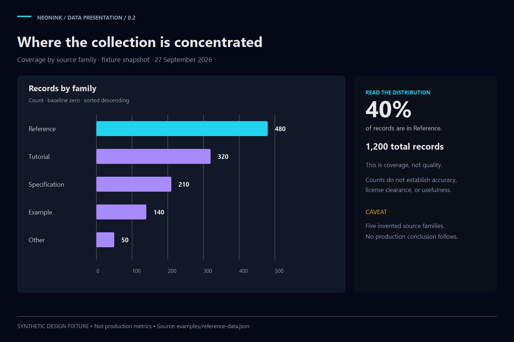

# NeonInk

**Data presentation system · v0.2.0 · Candidate active**

NeonInk gives Aptlantis data a clear, expressive presentation language: dark ink surfaces, deliberate semantic color, readable charts, dataset profiles, analytical reports, and portable visual artifacts. Blue Slate is the house theme for dense technical applications; NeonInk serves their presentation and storytelling surfaces.

## Start here

- [Integrated overview](spec/NeonInk.Overview.md) and [design specification](spec/NeonInk.DesignSystem.md)
- [Data visualization contract](spec/Data-Visualization.md) and [layout patterns](spec/layout/NeonInk.LayoutPatterns.md)
- [Canonical TOML tokens](spec/tokens/NeonInk.Tokens.toml), [token contract](spec/tokens/Token-Contract.md), and [hex / OKLCH table](generated/Color-Representations.md)
- [Reference images](spec/references/Reference-Catalog.md) and [responsive HTML specimen](examples/presentation.html)
- [Agent skill](skills/aptlantis-neonink/SKILL.md) and [implementation profiles](spec/frameworks/NeonInk.Profiles.md)
- [Adoption guide](Adoption-Guide.md), [validation checklist](Validation-Checklist.md), and [suite manifest](NeonInk.manifest.toml)
- [Migration and deprecation](Migration-0.2.md), [governance index](Governance-Index.md), and [review evidence](reports/Review-2026-09-27.md)



The reference uses visibly labeled synthetic data. It demonstrates composition, not production results.

## Compile and verify

Python 3.11+; no third-party Python packages are needed for the compiler, tests, or SVG renderer. ImageMagick is used only for PNG previews.

```powershell
python tools/compile_neonink.py
python tools/compile_neonink.py --check
python tools/test_compiler.py
python tools/render_references.py
python tools/render_references.py --check
python D:/.city_hall/SFDS/tools/sfds_validate.py D:/.city_hall/NeonInk
```

The source retains exact hex alongside OKLCH. Generated CSS has a hex fallback. The contrast report validates declared opaque pairings; real charts, controls, exports and host integrations require adoption checks.

## Authority and preservation

Canonical root: `D:\.city_hall\NeonInk`. Current rules live in `spec/`; generated files are translations. Version 0.2 supersedes the previous website-wide contracts for new work. `Docs/` and old `assets/` remain historical. The entire `manga/` tree is deprecated and has no bearing on current NeonInk design. Nothing was deleted.

Candidate maturity remains explicit until representative adopters supply runtime, accessibility, and export evidence. This suite update does not retheme applications or publish a website.
