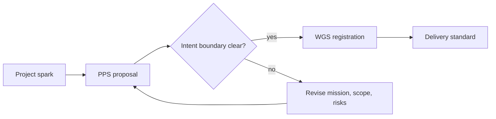

# Project Proposal Standard (PPS)

PPS governs project creation before code boundaries are drawn. It is the north star standard for project intent: problem, mission, boundaries, success, failure, constraints, risks, responsibility posture, version completion shape, and roadmap.

## Document Suite

| File | Purpose |
| --- | --- |
| `PPS.md` | Existing primary PPS draft. |
| `Project Proposal Standard.md` | Formal SFDS-shaped specification wrapper. |
| `PPS.manifest.toml` | Standard manifest for PPS. |
| `ProjectProposal.manifest.schema.toml` | Machine-readable proposal manifest shape. |
| `templates/Project-Proposal.md` | Proposal template. |
| `templates/PROJECT.manifest.toml` | Generic v2.4 project-manifest template; real projects use entity-named manifests. |
| `tools/pps_new.py` | Lightweight generator for proposal and entity-manifest skeletons. |
| `tools/pps_validate.py` | Lightweight validator for proposal manifest fields and readiness vocabulary. |
| `WGS-Lifecycle-Mapping.md` | PPS readiness to WGS lifecycle mapping. |
| `CI-Usage.md` | Local and CI validation snippets for PPS proposal checks. |
| `Proposal-Metadata-JSONL.md` | JSONL export shape for proposal indexing. |
| `Delivery-Standard-Mapping.md` | PPS-to-delivery-standard handoff examples. |
| `examples/Example-CLI-Project-Proposal.md` | Filled proposal example for a CTS-governed CLI tool. |
| `examples/Proposal-To-Delivery-Handoff.md` | Worked example of PPS adoption through delivery-standard handoff. |
| `examples/Example-Proposal.manifest.toml` | Machine-readable proposal manifest example for validator checks. |
| `examples/proposal-snapshots/` | Archival proposal snapshots showing readiness transition evidence. |
| `Adoption-Guide.md` | How new projects adopt PPS. |
| `Validation-Checklist.md` | Manual proposal readiness check. |
| `CHANGELOG.md` | PPS version history. |

## SFDS Suite Model

`PPS.manifest.toml` describes PPS as a standard suite.
`ProjectProposal.manifest.schema.toml` and the templates in `templates/` describe proposal and project records governed by PPS.

## Governance Role

WGS decides where a project lives and how it is registered.
PPS decides whether the project intent is clear enough to create, revive, expand, or resume.
DRS, CTS, SIS, WDS, DDS, and other delivery standards govern execution after PPS has frozen the intent boundary.

## Validation Posture

PPS is operational through its proposal template, filled examples, adoption guide, schema, manual validation checklist, WGS lifecycle mapping, `tools/pps_new.py` skeleton generator, and `tools/pps_validate.py` proposal-field checker.

`tools/pps_new.py` creates starting artifacts only. `tools/pps_validate.py` checks required fields and vocabulary; proposal readiness remains a human review gate.

