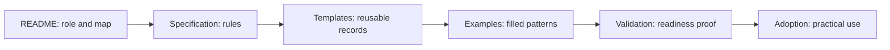
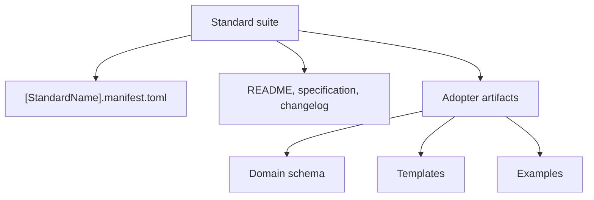

# Standards Framework Development Standard (SFDS)

SFDS defines how Aptlantis standards are written, versioned, validated, adopted, and preserved.

SFDS is the standard that dictates how the other City Hall standards are formulated.
Every standard directory needs a README explaining that standard's role in the City Hall system and a primary specification containing the actual standard.

DRS is the first reference implementation for this pattern. Use it to understand how a mature standard suite can include a primary specification, suite manifest, adopter-facing schema, templates, examples, validation guidance, and executable helpers without rewriting the domain standard from scratch.

WGS and LDS provide additional non-DRS reference examples for governance-shaped and library-shaped standard suites.

## Document Suite

| File | Purpose |
| --- | --- |
| `Standards Framework Development Standard.md` | Primary specification. |
| `STANDARD.manifest.schema.toml` | Machine-readable shape for standard manifests. |
| `SFDS-Validation-Guidance.md` | Manual suite-conformance validation procedure for SFDS-governed standards. |
| `tools/sfds_validate.py` | Lightweight executable validator for standard-suite manifest shape and registered artifacts. |
| `Compatibility-Matrix.md` | Machine-readable vocabulary and compatibility policy for standard manifests. |
| `CI-Usage.md` | Local and CI examples for running SFDS validation. |
| `Governance-Notes.md` | Policy clarifications for suite normalization, validators, and maturity claims. |
| `templates/` | Reusable documents for every standard suite. |
| `examples/` | Filled examples for future reference implementations. |
| `Adoption-Guide.md` | How a project or standard adopts SFDS. |
| `Validation-Checklist.md` | Manual validation checklist before a standard is considered adoptable. |
| `CHANGELOG.md` | Version history for SFDS. |

## One-Sentence Rule

The README explains the role, the specification defines the rules, the examples demonstrate the rules, and the validator proves the rules.

## Reference Pattern

SFDS uses a two-layer model:

- `[StandardName].manifest.toml` describes the standard suite itself.
- Domain schemas and templates describe projects or artifacts governed by the standard.

For example, DRS has a suite manifest at `DRS/DRS.manifest.toml`, while desktop application adopters use `DRS/DesktopApplicationRelease.manifest.schema.toml` and `DRS/templates/ProjectName.manifest.toml`.

## Required Standard Directory Pattern

Every City Hall standard directory must provide:

- `README.md` as the navigable role statement and document map.
- A primary standard document as the authoritative ruleset.
- `[StandardName].manifest.toml` as the machine-readable suite index.
- Adoption, validation, and changelog files.

Templates, examples, schemas, and validators are required when the standard's domain needs adopter artifacts or checkable compliance. If they are not applicable, the standard must say so explicitly.
