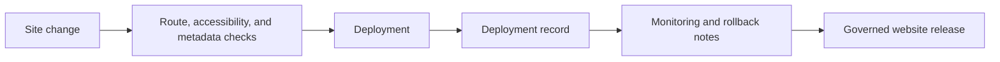

# Website Development Standard (WDS)

WDS governs websites and web applications as maintained projects rather than loose page collections. It requires deployment evidence, accessibility and metadata checks, route verification, rollback expectations, and monitoring notes.

## Document Suite

| File | Purpose |
| --- | --- |
| `Website Development Standard.md` | Primary WDS specification. |
| `WDS.manifest.toml` | Standard manifest. |
| `SiteManifest.schema.toml` | Machine-readable site manifest shape. |
| `templates/Site-Manifest.toml` | Site manifest template. |
| `templates/Deployment-Record.md` | Deployment record template. |
| `tools/wds_validate.py` | Lightweight site manifest validator. |
| `tools/route_check.py` | Route availability smoke-check helper. |
| `tools/accessibility_smoke.py` | HTML accessibility and metadata smoke-check helper. |
| `tools/fill_deployment_record.py` | Deployment-record filler for CI metadata and commit artifacts. |
| `Publication-Approval-Flow.md` | WGS registration and WDS publication approval flow. |
| `Route-Check-Harness.md` | Reusable preview and production route-check harness guidance. |
| `Monitoring-Integration-Fields.md` | Optional vendor-neutral monitoring fields for site manifests. |
| `examples/Example-Deployment-Record.md` | Filled deployment evidence example. |
| `examples/SiteMetadata.jsonld` | Optional JSON-LD metadata example for WDS sites. |
| `tests/CONFORMANCE.md` | Minimal conformance suite and example validator output. |
| `Adoption-Guide.md` | How web projects adopt WDS. |
| `Validation-Checklist.md` | Site readiness checklist. |
| `CHANGELOG.md` | WDS version history. |

## SFDS Suite Model

`WDS.manifest.toml` describes WDS as a standard suite.
The templates in `templates/` describe site manifests and deployment records governed by WDS.

## Validation Posture

WDS is operational through `SiteManifest.schema.toml`, the site manifest template, the deployment record template, filled examples, the adoption guide, the manual validation checklist, and lightweight validators under `tools/`.

The WDS tools provide smoke-check evidence. They do not replace full accessibility audits, browser compatibility review, or production monitoring.

## Publication Rule

A deployment without a deployment record is a file upload, not a governed website release.

