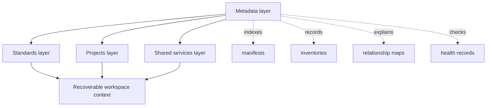

# Workspace Governance Standard (WGS)

WGS is the constitutional layer for the Aptlantis workspace.
It governs root structure, workspace manifests, project registration, standard relationships, workspace services, and agent orientation.

WGS treats the workspace as a governed ecosystem rather than a loose collection of repositories. Its job is to make projects discoverable, keep context recoverable, reduce repeated structural decisions, and give agents a predictable way to orient before making changes.

## Document Suite

| File | Purpose |
| --- | --- |
| `Workspace Governance Standard.md` | Primary WGS specification. |
| `WGS.manifest.toml` | Standard manifest. |
| `Workspace-Governance-Implementation-Plan.md` | Current implementation plan. |
| `Workspace-Recovery-Plan-2026-08-22.md` | Post-PPS recovery plan separating onboarding, verification, and maintenance. |
| `Workspace-Inventory.md` | Current-state inventory. |
| `Target-Directory-Map.md` | Proposed target state. |
| `Manifest-Conventions.md` | Manifest naming and placement policy. |
| `Agent-Closeout-Procedure.md` | Required closeout steps for agent changes in governed workspace roots. |
| `Workspace-Audit-Dashboard-Spec.md` | Machine-readable audit and dashboard dataset contract for WGS tooling. |
| `EntityManifest-v2.4.schema.json` | JSON Schema export for the current entity manifest model. |
| `Entity-Manifest-Query-Store.md` | Reference SQLite/DuckDB-style query-store shape for entity manifests and audit records. |
| `CI-Usage.md` | Local, scheduled, and CI audit snippets for WGS checks. |
| `templates/AGENTS.root.md` | Root instruction template. |
| `templates/AGENTS.directory.md` | Governed-directory instruction template. |
| `templates/AGENTS.project.md` | Project and project-group instruction template. |
| `templates/DirectoryName.manifest.toml` | Entity-named governed-directory manifest template. |
| `templates/ProjectName.manifest.toml` | Entity-named project and project-group manifest template. |
| `templates/Development.manifest.toml` | Development-drive identity and root-registry template. |
| `templates/Project-README.md` | Internal project orientation and handoff template. |
| `templates/Workspace-Health-Record.md` | Repeatable workspace health review template. |
| `examples/City-Hall-Health-Record.md` | Filled health record for City Hall. |
| `examples/Library-Root-Health-Record.md` | Filled health record for the governed library root. |
| `Agent-Startup-Procedure.md` | Required read order for agents. |
| `tools/city_hall_audit.py` | Entity-aware standards and workspace validator. |
| `tools/workspace_inventory.py` | Read-only physical/registered drift report. |
| `tools/governance_scaffold.py` | Dry-run-first entity scaffold and parent registration tool. |
| `tools/snapshot_root_governance.py` | SHA-256 checked root-governance recovery snapshot tool. |
| `tools/manifest_diff.py` | Read-only TOML manifest comparison helper. |
| `tools/link_integrity.py` | Local Markdown link integrity checker. |
| `examples/Workspace-Health-Dashboard.html` | Minimal static dashboard example for WGS audit records. |
| `Documentation-Suite-Roadmap.md` | Standards documentation normalization tracker. |
| `Governance-Responsibility-Matrix.md` | Ownership and collision rules across standards. |
| `Reference-Index.md` | Preserved planning lineage and conversation references. |
| `Cleanup-Log.md` | Record of root cleanup and reference relocation. |

## SFDS Suite Model

`WGS.manifest.toml` describes WGS as a standard suite.
The manifest templates in `templates/` describe workspace, directory, project, and standard records governed by WGS.

## Validation Posture

WGS is currently operational through its manifest model, templates, examples, validation checklist, and registered tools in `WGS.manifest.toml`. Those tools include workspace inventory, audit, scaffold, manifest normalization, and root-governance snapshot workflows.

Future audit, dashboard, suite-completeness, and link-integrity work remains roadmap work, not missing baseline validation. Reviews should treat those items as planned deepening unless WGS claims a specific executable check that is absent.

## Core Model

WGS organizes the workspace around four layers:

- Standards layer: WGS, SFDS, PPS, DRS, CTS, SIS, WDS, DDS, LDS, Blue Slate, and specialized standards.
- Projects layer: artifact-producing projects and technical systems.
- Shared services layer: workspace-level services, caches, automation, and agent support.
- Metadata layer: manifests, registries, relationship maps, inventories, and health records.

The metadata layer is the spine. It makes intent search, lifecycle visibility, and long-term project reactivation possible.

## Agent Rule

Agents must orient from inherited instructions, manifests, and governing documents before making broad changes. The normal read order is root-to-local `AGENTS.md`, directory manifest, project manifest, `Project-README.md`, canonical governing standards, and roadmap or handoff notes.

```mermaid
flowchart LR
    WorkspaceManifest["Workspace manifest"]
    DirectoryManifest["Directory manifest"]
    ProjectManifest["Project manifest"]
    IdentityDocs["Project identity docs"]
    GoverningStandard["Governing standard"]
    Roadmap["Roadmap or handoff notes"]
    Work["Scoped work"]

    WorkspaceManifest --> DirectoryManifest --> ProjectManifest --> IdentityDocs --> GoverningStandard --> Roadmap --> Work
```

## Tone

WGS exists to reduce ambiguity, not to create paperwork.
Every rule should help a future human or agent recover context, make fewer guesses, and avoid project drift.
