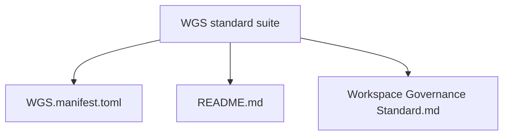
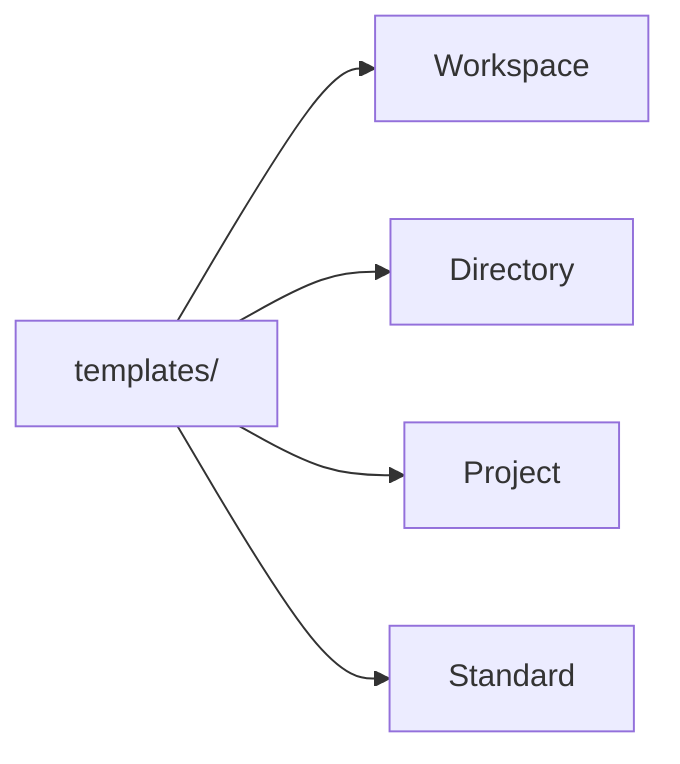
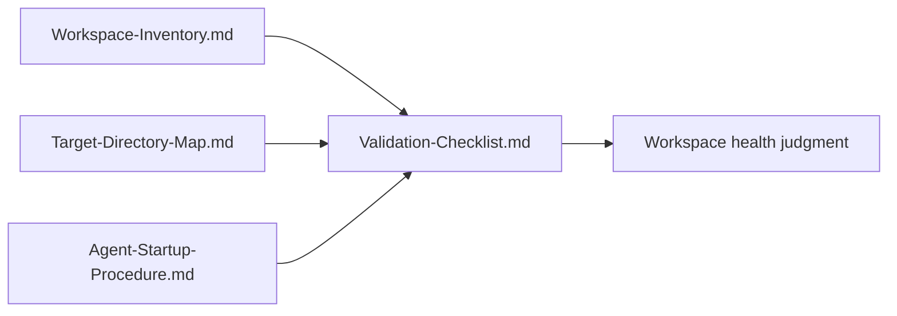

# WGS Suite Map

## Suite Layer

WGS is indexed by `WGS.manifest.toml`, `README.md`, and `Workspace Governance Standard.md`.

## Adopter Layer

Workspace adopters use the manifest templates in `templates/`: workspace, directory, project, and standard manifests.

## Validation Layer

Validate workspace health with `Validation-Checklist.md`, `Workspace-Inventory.md`, `Target-Directory-Map.md`, and `Agent-Startup-Procedure.md`.

