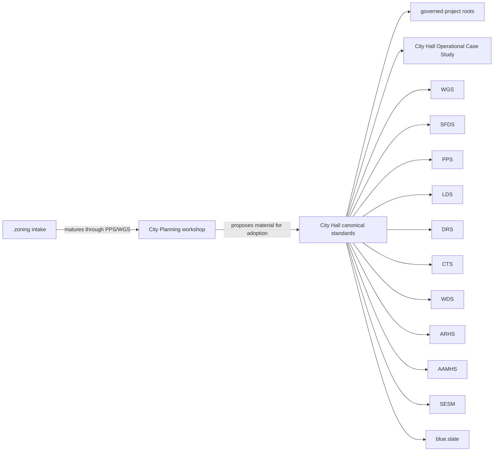

# City Hall Map

This is the active guided map for Aptlantis standards and adopted governance references.
It lives in `D:\.city_hall` because these records are the canonical active governance resource.

`D:\.city_hall\City Planning` holds incubation, experiments, promotion review, historical lineage, and sandboxed governance development.

## Start With These

| Area | Role | Why It Matters | Primary Standards |
| --- | --- | --- | --- |
| `City Hall` | Active standards resource | Gives active projects their canonical standards, templates, and adopted governance overview. | WGS, SFDS |
| `City Hall Operational Case Study` | Adopted governance evidence | Shows a standards workflow recovering context, identifying a standard gap, creating LDS through SFDS, and stopping before unauthorized implementation. | WGS, PPS, SFDS, LDS |
| `City Planning` | Standards workshop and sandbox | Preserves drafts, experiments, promotion history, and lineage that are useful but not automatically governing. | WGS, SFDS |
| `.zoning` | Intake and incubation area | Gives rough project and standard ideas a place to collect notes before governed placement. | PPS, WGS |
| `DRS` portfolio | Desktop applications | Exercises desktop release evidence, Windows GUI distribution policy, and artifact verification. | DRS, ARHS |
| `CTS` portfolio | Command tools and automation | Exercises CLI contracts, package-ecosystem releases, structured output, and command safety. | CTS, ARHS |
| `DATA` portfolio | Shared datasets | Preserves source snapshots, provenance, schemas, validation, and dataset integrity records. | DDS, AAMHS |
| `WDS` portfolio | Websites and web applications | Exercises website manifests, deployment records, accessibility, routes, rollback, and monitoring. | WDS |

## Reading Paths

For active governance:

1. `D:\AGENTS.md`
2. `D:\INDEX.md`
3. `D:\.city_hall\README.md`
4. `D:\.city_hall\WGS\README.md`
5. the suite README for the affected project class

For standards creation or promotion:

1. `D:\.city_hall\SFDS\README.md`
2. `D:\.city_hall\SFDS\Standards Framework Development Standard.md`
3. `D:\.city_hall\README.md`
4. `D:\.city_hall\WORKSHOP-MAP.md`
5. relevant City Hall draft, lineage, or promotion notes

For releases and integrity:

1. `D:\.city_hall\DRS\README.md` for Windows GUI applications.
2. `D:\.city_hall\CTS\README.md` for command tools and package ecosystem releases.
3. `D:\.city_hall\ARHS\README.md` for `.hashmanifest.toml` release hash manifests.
4. `D:\.city_hall\AAMHS\README.md` for archive-preservation hash/signature records.

## Root Governance Drift

`D:\Development.manifest.toml` was restored on 2026-08-20 as the machine-readable root registry.
If it is missing in a future pass, record the gap, use `D:\AGENTS.md` and `D:\INDEX.md` as the root recovery path, and restore the manifest only through an explicit root-governance pass.

## Operating Taste

- Local-first by default.
- Metadata matters.
- Operator-centered design.
- Integrity is a feature.
- Preservation over polish.
- Repeatability wins.
- Small tools can be serious tools.
- Authority should be identifiable.
- Context should survive handoff.
