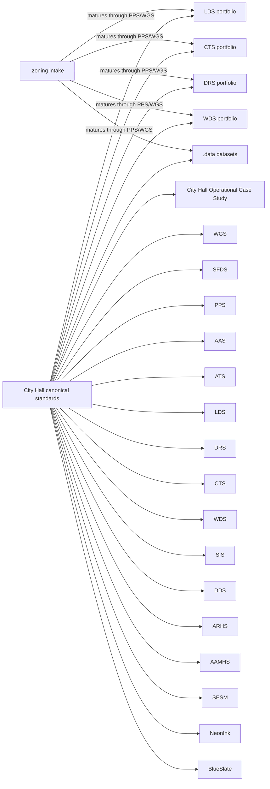

# City Hall Map

This is the active guided map for Aptlantis standards and adopted governance references.
It lives in `D:\.city_hall` because these records are the canonical active governance resource.

City Planning is not an active City Hall child. Dated City Planning references are historical migration evidence only; active standards live directly in City Hall.

```mermaid
flowchart LR
    Core["City Hall canonical standards"]
    Zoning[".zoning intake"]
    LDS["LDS portfolio"]
    CTS["CTS portfolio"]
    DRS["DRS portfolio"]
    WDS["WDS portfolio"]
    Data[".data datasets"]
    CaseStudy["City Hall Operational Case Study"]

    WGS["WGS"]
    SFDS["SFDS"]
    PPS["PPS"]
    AAS["AAS"]
    ATS["ATS"]
    LDSStd["LDS"]
    DRSStd["DRS"]
    CTSStd["CTS"]
    WDSStd["WDS"]
    SIS["SIS"]
    DDS["DDS"]
    ARHS["ARHS"]
    AAMHS["AAMHS"]
    SESM["SESM"]
    NeonInk["NeonInk"]
    BlueSlate["BlueSlate"]

    Zoning -->|"matures through PPS/WGS"| LDS
    Zoning -->|"matures through PPS/WGS"| CTS
    Zoning -->|"matures through PPS/WGS"| DRS
    Zoning -->|"matures through PPS/WGS"| WDS
    Zoning -->|"matures through PPS/WGS"| Data
    Core --> LDS
    Core --> CTS
    Core --> DRS
    Core --> WDS
    Core --> Data
    Core --> CaseStudy

    Core --> WGS
    Core --> SFDS
    Core --> PPS
    Core --> AAS
    Core --> ATS
    Core --> LDSStd
    Core --> DRSStd
    Core --> CTSStd
    Core --> WDSStd
    Core --> SIS
    Core --> DDS
    Core --> ARHS
    Core --> AAMHS
    Core --> SESM
    Core --> NeonInk
    Core --> BlueSlate
```

## Start With These

| Area | Role | Why It Matters | Primary Standards |
| --- | --- | --- | --- |
| `City Hall` | Active standards resource | Gives active projects their canonical standards, templates, and adopted governance overview. | WGS, SFDS |
| `City Hall Operational Case Study` | Adopted governance evidence | Shows a standards workflow recovering context, identifying a standard gap, creating LDS through SFDS, and stopping before unauthorized implementation. | WGS, PPS, SFDS, LDS |
| `.zoning` | Intake and incubation area | Holds a large active backlog that is expected to move into governed roots over time; it is not clutter. | PPS, WGS |
| `LDS` portfolio | Libraries, language tooling, packages, and theme source | Houses library-first work including `SiYuan-Themes`. | LDS, WGS, PPS |
| `DRS` portfolio | Desktop applications | Exercises desktop release evidence, Windows GUI distribution policy, and artifact verification. | DRS, ARHS |
| `CTS` portfolio | Command tools and automation | Exercises CLI contracts, package-ecosystem releases, structured output, and command safety. | CTS, ARHS |
| `.data` portfolio | Shared datasets | Preserves source snapshots, provenance, schemas, validation, and dataset integrity records. | DDS, AAMHS |
| `WDS` portfolio | Websites and web applications | Exercises website manifests, deployment records, accessibility, routes, rollback, and monitoring. | WDS |

## Reading Paths

For active governance:

1. `D:\AGENTS.md`
2. `D:\INDEX.md`
3. `D:\.city_hall\README.md`
4. `D:\.city_hall\WGS\README.md`
5. the suite README for the affected project class

For standards advancement:

1. `D:\.city_hall\SFDS\README.md`
2. `D:\.city_hall\SFDS\Standards Framework Development Standard.md`
3. `D:\.city_hall\README.md`
4. `D:\.city_hall\WORKSHOP-MAP.md`
5. the candidate standard's manifest, changelog, validation checklist, examples, and tooling evidence

For releases and integrity:

1. `D:\.city_hall\DRS\README.md` for Windows GUI applications.
2. `D:\.city_hall\CTS\README.md` for command tools and package ecosystem releases.
3. `D:\.city_hall\ARHS\README.md` for `.hashmanifest.toml` release hash manifests.
4. `D:\.city_hall\AAMHS\README.md` for archive-preservation hash/signature records.

## Root Governance Drift

`D:\Development.manifest.toml` is the machine-readable root registry.
If it is missing in a future pass, record the gap, use `D:\AGENTS.md` and `D:\INDEX.md` as the root recovery path, and restore the manifest only through an explicit root-governance pass.

## Operating Taste

- Local-first by default.
- Metadata matters.
- Operator-centered design.
- Integrity is a feature.
- Preservation over polish.
- Repeatability wins.
- Small tools can be serious tools.
- Authority should be identifiable.
- Context should survive handoff.
## Blue Slate adoption — 2026-09-27

[Blue Slate v0.5.0](BlueSlate/README.md) adopts the reviewed desktop source workspace into the existing canonical suite. Maturity remains Candidate/candidate-active. Read the [migration boundary](BlueSlate/Migration-0.5.md), [directory review](BlueSlate/reports/Review-2026-09-27.md), and [agent skill](BlueSlate/skills/aptlantis-blue-slate/SKILL.md). The desktop source was outside zoning; no physical workspace relocation or live adopter deployment is implied.

## NeonInk data-presentation revision — 2026-09-27

[NeonInk v0.2.0](NeonInk/README.md) supplies data presentation, charts, OKLCH tokens, reference boards and a [comprehensive agent skill](NeonInk/skills/aptlantis-neonink/SKILL.md). Blue Slate remains the house theme for dense operational applications. All manga material is deprecated; previous website documents/assets remain historical. Read the [migration](NeonInk/Migration-0.2.md) and [review evidence](NeonInk/reports/Review-2026-09-27.md). Candidate maturity does not establish live adopter or accessibility conformance.

## Current hardening review

See [2026-10-02 remediation evidence](WGS/reports/Framework-Gap-Remediation-2026-10-02.md), [SFDS promotion gate](SFDS/Promotion-Gate.md), [DRS stage evidence](DRS/templates/Release-Stage-Evidence.toml), and [reviewed catalog](WGS/catalog/city-hall.json). These checks do not promote candidate suites or establish external deployment readiness.
